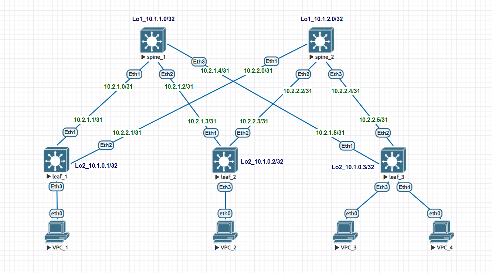

# Домашнее задание №1
## Проектирование адресного пространства

### Задачи:

- Собрать схему CLOS;
- Распределить адресное пространство.

## Выполнение:

### Собранная схема сети




### Таблица адресов

| hostname | interface |   IP/MASK   | Description |
| :------: | :-------: | :----------: | :---------: |
|  leaf_1  | Loopback2 | 10.1.0.1 /32 |            |
|  leaf_1  |  eth 1    | 10.2.1.1 /31 | to-spine_1 |
|  leaf_1  |  eth 2    | 10.2.2.1 /31 | to-spine_2 |
|          |          |              |            |
|  leaf_2  | Loopback2 | 10.1.0.2 /32 |            |
|  leaf_2  |  eth 1    | 10.2.1.3 /31 | to-spine_1 |
|  leaf_2  |  eth 2    | 10.2.2.3 /31 | to-spine_2 |
|          |          |              |            |
|  leaf_3  | Loopback2 | 10.1.0.3 /32 |            |
|  leaf_3  |  eth 1    | 10.2.1.5 /31 | to-spine_1 |
|  leaf_3  |  eth 2    | 10.2.2.5 /31 | to-spine_2 |
|          |          |              |            |
| spine_1 | Loopback1 | 10.1.1.0/32 |            |
| spine_1 |  eth 1    | 10.2.1.0/31 |  to-leaf_1  |
| spine_1 |  eth 2    | 10.2.1.2/31 |  to-leaf_2  |
| spine_1 |  eth 3    | 10.2.1.4/31 |  to-leaf_3  |
|          |          |              |            |
| spine_2 | Loopback1 | 10.1.2.0/32 |            |
| spine_2 |  eth 1    | 10.2.2.0/31 |  to-leaf_1  |
| spine_2 |  eth 2    | 10.2.2.2/31 |  to-leaf_2  |
| spine_2 |  eth 3    | 10.2.2.4/31 |  to-leaf_3  |

### Конфигурация оборудования

- #### [leaf_1](config/leaf_1.conf)

```
hostname leaf_1
!
interface Ethernet1
   description to-spine_1
   no switchport
   ip address 10.2.1.1/31
!
interface Ethernet2
   description to-spine_2
   no switchport
   ip address 10.2.2.1/31
!
interface Loopback2
   ip address 10.1.0.1/32

```

- #### [leaf_2](config/leaf_2.conf)

```
hostname leaf_2
!
interface Ethernet1
   description to-spine_1
   no switchport
   ip address 10.2.1.3/31
!
interface Ethernet2
   description to-spine_2
   no switchport
   ip address 10.2.2.3/31
!
interface Loopback2
   ip address 10.1.0.2/32
```

- #### [leaf_3](config/leaf_3.conf)

```
hostname leaf_3
!
interface Ethernet1
   description to-spine_1
   no switchport
   ip address 10.2.1.5/31
!
interface Ethernet2
   description to-spine_2
   no switchport
   ip address 10.2.2.5/31
!
interface Ethernet4
!
interface Loopback2
   ip address 10.1.0.3/32
```

- #### [spine_1](config/spine_1.conf)

```
hostname spine_1
!
interface Ethernet1
   description to-leaf_1
   no switchport
   ip address 10.2.1.0/31
!
interface Ethernet2
   description to-leaf_2
   no switchport
   ip address 10.2.1.2/31
!
interface Ethernet3
   description to-leaf_3
   no switchport
   ip address 10.2.1.4/31
!
interface Loopback1
   ip address 10.1.1.0/32
```

- #### [spine_2](config/spine_2.conf)

```
hostname spine_2
!
interface Ethernet1
   description to-leaf_1
   no switchport
   ip address 10.2.2.0/31
!
interface Ethernet2
   description to-leaf_2
   no switchport
   ip address 10.2.2.2/31
!
interface Ethernet3
   description to-leaf_3
   no switchport
   ip address 10.2.2.4/31
!
interface Loopback1
   ip address 10.1.2.0/32
```

### Проверка доступности

- #### spine_1

~~~
spine_1#ping 10.2.1.1
PING 10.2.1.1 (10.2.1.1) 72(100) bytes of data.
80 bytes from 10.2.1.1: icmp_seq=1 ttl=64 time=28.3 ms
80 bytes from 10.2.1.1: icmp_seq=2 ttl=64 time=11.5 ms
80 bytes from 10.2.1.1: icmp_seq=3 ttl=64 time=5.72 ms
80 bytes from 10.2.1.1: icmp_seq=4 ttl=64 time=4.54 ms
80 bytes from 10.2.1.1: icmp_seq=5 ttl=64 time=4.56 ms

--- 10.2.1.1 ping statistics ---
5 packets transmitted, 5 received, 0% packet loss, time 94ms
rtt min/avg/max/mdev = 4.542/10.957/28.382/9.093 ms, pipe 2, ipg/ewma 23.577/19.221 ms
spine_1#ping 10.2.1.3
PING 10.2.1.3 (10.2.1.3) 72(100) bytes of data.
80 bytes from 10.2.1.3: icmp_seq=1 ttl=64 time=24.3 ms
80 bytes from 10.2.1.3: icmp_seq=2 ttl=64 time=9.98 ms
80 bytes from 10.2.1.3: icmp_seq=3 ttl=64 time=4.32 ms
80 bytes from 10.2.1.3: icmp_seq=4 ttl=64 time=4.57 ms
80 bytes from 10.2.1.3: icmp_seq=5 ttl=64 time=4.73 ms

--- 10.2.1.3 ping statistics ---
5 packets transmitted, 5 received, 0% packet loss, time 80ms
rtt min/avg/max/mdev = 4.326/9.601/24.387/7.688 ms, pipe 2, ipg/ewma 20.142/16.637 ms
spine_1#ping 10.2.1.5
PING 10.2.1.5 (10.2.1.5) 72(100) bytes of data.
80 bytes from 10.2.1.5: icmp_seq=1 ttl=64 time=21.5 ms
80 bytes from 10.2.1.5: icmp_seq=2 ttl=64 time=9.89 ms
80 bytes from 10.2.1.5: icmp_seq=3 ttl=64 time=4.82 ms
80 bytes from 10.2.1.5: icmp_seq=4 ttl=64 time=5.48 ms
80 bytes from 10.2.1.5: icmp_seq=5 ttl=64 time=4.80 ms

--- 10.2.1.5 ping statistics ---
5 packets transmitted, 5 received, 0% packet loss, time 71ms
rtt min/avg/max/mdev = 4.807/9.311/21.548/6.406 ms, pipe 2, ipg/ewma 17.947/15.122 ms

~~~

- #### spine_2

~~~
spine_2#ping 10.2.2.1
PING 10.2.2.1 (10.2.2.1) 72(100) bytes of data.
80 bytes from 10.2.2.1: icmp_seq=1 ttl=64 time=23.7 ms
80 bytes from 10.2.2.1: icmp_seq=2 ttl=64 time=11.5 ms
80 bytes from 10.2.2.1: icmp_seq=3 ttl=64 time=4.09 ms
80 bytes from 10.2.2.1: icmp_seq=4 ttl=64 time=4.54 ms
80 bytes from 10.2.2.1: icmp_seq=5 ttl=64 time=5.07 ms

--- 10.2.2.1 ping statistics ---
5 packets transmitted, 5 received, 0% packet loss, time 76ms
rtt min/avg/max/mdev = 4.095/9.809/23.764/7.493 ms, pipe 2, ipg/ewma 19.155/16.422 ms
spine_2#ping 10.2.2.3
PING 10.2.2.3 (10.2.2.3) 72(100) bytes of data.
80 bytes from 10.2.2.3: icmp_seq=1 ttl=64 time=17.3 ms
80 bytes from 10.2.2.3: icmp_seq=2 ttl=64 time=8.54 ms
80 bytes from 10.2.2.3: icmp_seq=3 ttl=64 time=4.61 ms
80 bytes from 10.2.2.3: icmp_seq=4 ttl=64 time=5.01 ms
80 bytes from 10.2.2.3: icmp_seq=5 ttl=64 time=4.95 ms

--- 10.2.2.3 ping statistics ---
5 packets transmitted, 5 received, 0% packet loss, time 56ms
rtt min/avg/max/mdev = 4.617/8.102/17.385/4.858 ms, pipe 2, ipg/ewma 14.094/12.515 ms
spine_2#ping 10.2.2.5
PING 10.2.2.5 (10.2.2.5) 72(100) bytes of data.
80 bytes from 10.2.2.5: icmp_seq=1 ttl=64 time=15.3 ms
80 bytes from 10.2.2.5: icmp_seq=2 ttl=64 time=6.71 ms
80 bytes from 10.2.2.5: icmp_seq=3 ttl=64 time=4.70 ms
80 bytes from 10.2.2.5: icmp_seq=4 ttl=64 time=4.97 ms
80 bytes from 10.2.2.5: icmp_seq=5 ttl=64 time=4.61 ms

--- 10.2.2.5 ping statistics ---
5 packets transmitted, 5 received, 0% packet loss, time 50ms
rtt min/avg/max/mdev = 4.619/7.274/15.357/4.113 ms, pipe 2, ipg/ewma 12.555/11.136 ms

~~~
