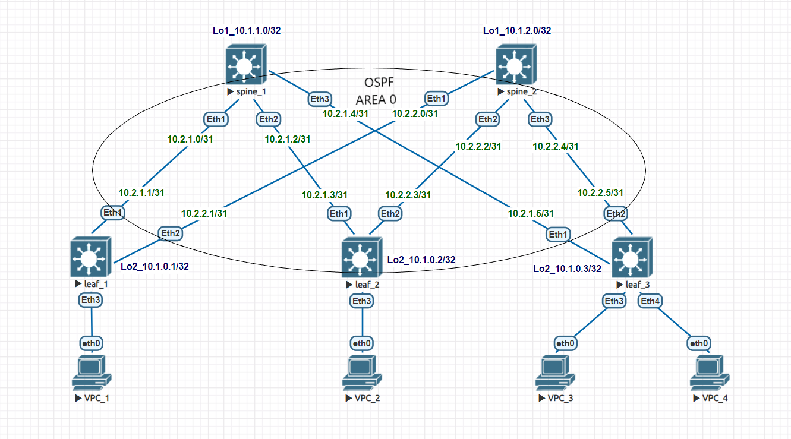

# Домашнее задание №2
## Underlay. OSPF

### Задача:

- Настроить протокол OSPF для Underlay сети
- Проверить связанность между устройствами

## Выполнение:

### Схема сети




### Конфигурация оборудования

- #### [leaf_1](config/leaf_1.conf)

```
hostname leaf_1
!
interface Ethernet1
   description to-spine_1
   no switchport
   ip address 10.2.1.1/31
   ip ospf area 0.0.0.0
!
interface Ethernet2
   description to-spine_2
   no switchport
   ip address 10.2.2.1/31
   ip ospf area 0.0.0.0
!
interface Loopback2
   ip address 10.1.0.1/32
   ip ospf area 0.0.0.0
!
ip routing
!
router ospf 1
   router-id 10.1.0.1
```

- #### [leaf_2](config/leaf_2.conf)

```
hostname leaf_2
!
interface Ethernet1
   description to-spine_1
   no switchport
   ip address 10.2.1.3/31
   ip ospf area 0.0.0.0
!
interface Ethernet2
   description to-spine_2
   no switchport
   ip address 10.2.2.3/31
   ip ospf area 0.0.0.0
!
interface Loopback2
   ip address 10.1.0.2/32
   ip ospf area 0.0.0.0
!
ip routing
!
router ospf 1
   router-id 10.1.0.2
```

- #### [leaf_3](config/leaf_3.conf)

```
hostname leaf_3
!
interface Ethernet1
   description to-spine_1
   no switchport
   ip address 10.2.1.5/31
   ip ospf area 0.0.0.0
!
interface Ethernet2
   description to-spine_2
   no switchport
   ip address 10.2.2.5/31
   ip ospf area 0.0.0.0
!
interface Loopback2
   ip address 10.1.0.3/32
   ip ospf area 0.0.0.0
!
ip routing
!
router ospf 1
   router-id 10.1.0.3
```

- #### [spine_1](config/spine_1.conf)

```
hostname spine_1
!
interface Ethernet1
   description to-leaf_1
   no switchport
   ip address 10.2.1.0/31
   ip ospf area 0.0.0.0
!
interface Ethernet2
   description to-leaf_2
   no switchport
   ip address 10.2.1.2/31
   ip ospf area 0.0.0.0
!
interface Ethernet3
   description to-leaf_3
   no switchport
   ip address 10.2.1.4/31
   ip ospf area 0.0.0.0
!
interface Loopback1
   ip address 10.1.1.0/32
   ip ospf area 0.0.0.0
!
ip routing
!
router ospf 1
   router-id 10.1.1.0
```

- #### [spine_2](config/spine_2.conf)

```
hostname spine_2
!
spanning-tree mode mstp
!
interface Ethernet1
   description to-leaf_1
   no switchport
   ip address 10.2.2.0/31
   ip ospf area 0.0.0.0
!
interface Ethernet2
   description to-leaf_2
   no switchport
   ip address 10.2.2.2/31
   ip ospf area 0.0.0.0
!
interface Ethernet3
   description to-leaf_3
   no switchport
   ip address 10.2.2.4/31
   ip ospf area 0.0.0.0
!
interface Loopback1
   ip address 10.1.2.0/32
   ip ospf area 0.0.0.0
!
interface Management1
!
ip routing
!
router ospf 1
   router-id 10.1.2.0
```
---
### Проверка связанности устройств по протоколу OSPF

- #### spine_1

```
spine_1#sh ip ospf neighbor
Neighbor ID     Instance VRF      Pri State                  Dead Time   Address         Interface
10.1.0.1        1        default  1   FULL/DR                00:00:37    10.2.1.1        Ethernet1
10.1.0.2        1        default  1   FULL/DR                00:00:35    10.2.1.3        Ethernet2
10.1.0.3        1        default  1   FULL/DR                00:00:35    10.2.1.5        Ethernet3
```

- #### spine_2

```
spine_2#sh ip ospf neighbor
Neighbor ID     Instance VRF      Pri State                  Dead Time   Address         Interface
10.1.0.1        1        default  1   FULL/DR                00:00:35    10.2.2.1        Ethernet1
10.1.0.2        1        default  1   FULL/DR                00:00:36    10.2.2.3        Ethernet2
10.1.0.3        1        default  1   FULL/DR                00:00:29    10.2.2.5        Ethernet3
```

- #### leaf_1

```
leaf_1#ping 10.1.0.2
PING 10.1.0.2 (10.1.0.2) 72(100) bytes of data.
80 bytes from 10.1.0.2: icmp_seq=1 ttl=63 time=27.3 ms
80 bytes from 10.1.0.2: icmp_seq=2 ttl=63 time=15.6 ms
80 bytes from 10.1.0.2: icmp_seq=3 ttl=63 time=11.6 ms
80 bytes from 10.1.0.2: icmp_seq=4 ttl=63 time=12.9 ms
80 bytes from 10.1.0.2: icmp_seq=5 ttl=63 time=9.51 ms

--- 10.1.0.2 ping statistics ---
5 packets transmitted, 5 received, 0% packet loss, time 72ms
rtt min/avg/max/mdev = 9.517/15.409/27.302/6.270 ms, pipe 3, ipg/ewma 18.240/21.                    033 ms
leaf_1#ping 10.1.0.3
PING 10.1.0.3 (10.1.0.3) 72(100) bytes of data.
80 bytes from 10.1.0.3: icmp_seq=1 ttl=63 time=17.5 ms
80 bytes from 10.1.0.3: icmp_seq=2 ttl=63 time=9.88 ms
80 bytes from 10.1.0.3: icmp_seq=3 ttl=63 time=14.3 ms
80 bytes from 10.1.0.3: icmp_seq=4 ttl=63 time=10.8 ms
80 bytes from 10.1.0.3: icmp_seq=5 ttl=63 time=9.66 ms

--- 10.1.0.3 ping statistics ---
5 packets transmitted, 5 received, 0% packet loss, time 68ms
rtt min/avg/max/mdev = 9.669/12.451/17.573/3.057 ms, ipg/ewma 17.062/14.890 ms
```