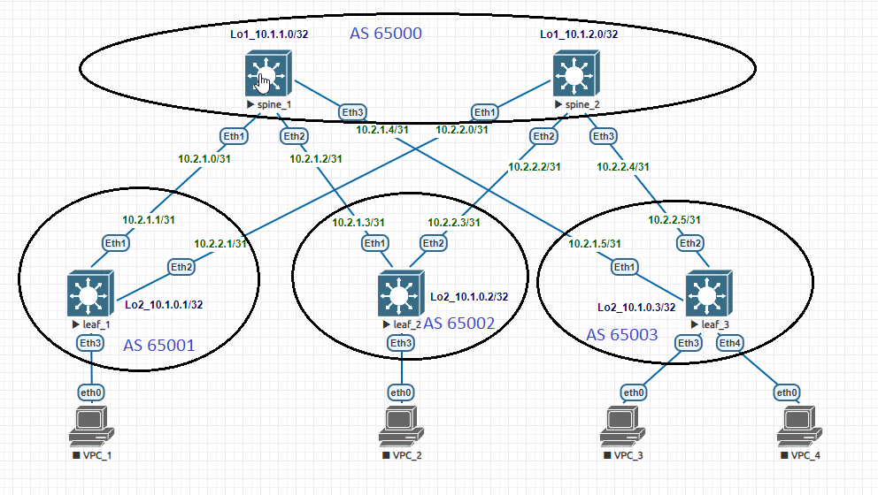

# Домашнее задание №4

## Underlay. eBGP

### Задача:

- Настроить протокол eBGP для Underlay сети
- Проверить связанность между устройствами

## Выполнение:

### Схема сети



### Конфигурация оборудования

- #### [leaf_1](config/leaf_1.conf)

```
ip routing
!
ip prefix-list loop
   seq 10 permit 10.1.0.1/32
!
route-map connect permit 10
   match ip address prefix-list loop
!
router bgp 65001
   router-id 10.1.0.1
   neighbor spine peer group
   neighbor spine remote-as 65000
   neighbor spine bfd
   neighbor 10.2.1.0 peer group spine
   neighbor 10.2.2.0 peer group spine
   redistribute connected route-map connect
```

- #### [leaf_2](config/leaf_2.conf)

```
ip routing
!
ip prefix-list loop
   seq 10 permit 10.1.0.2/32
!
route-map connect permit 10
   match ip address prefix-list loop
!
router bgp 65002
   router-id 10.1.0.2
   neighbor spine peer group
   neighbor spine remote-as 65000
   neighbor spine bfd
   neighbor 10.2.1.2 peer group spine
   neighbor 10.2.2.2 peer group spine
   redistribute connected route-map connect
```

- #### [leaf_3](config/leaf_3.conf)

```
ip routing
!
ip prefix-list loop
   seq 10 permit 10.1.0.3/32
!
route-map connect permit 10
   match ip address prefix-list loop
!
router bgp 65003
   router-id 10.1.0.3
   neighbor spine peer group
   neighbor spine remote-as 65000
   neighbor spine bfd
   neighbor 10.2.1.4 peer group spine
   neighbor 10.2.2.4 peer group spine
   redistribute connected route-map connect
```

- #### [spine_1](config/spine_1.conf)

```
ip routing
!
ip prefix-list loop
   seq 10 permit 10.1.1.0/32
!
route-map connect permit 10
   match ip address prefix-list loop
!
peer-filter leaf
   10 match as-range 65001-65003 result accept
!
router bgp 65000
   router-id 10.1.1.0
   bgp listen range 10.2.1.0/24 peer-group leaf peer-filter leaf
   neighbor leaf peer group
   neighbor leaf bfd
   redistribute connected route-map connect
```

- #### [spine_2](config/spine_2.conf)

```
ip routing
!
ip prefix-list loop
   seq 10 permit 10.1.2.0/32
!
route-map connect permit 10
   match ip address prefix-list loop
!
peer-filter leaf
   10 match as-range 65001-65003 result accept
!
router bgp 65000
   router-id 10.1.2.0
   bgp listen range 10.2.2.0/24 peer-group leaf peer-filter leaf
   neighbor leaf peer group
   neighbor leaf bfd
   redistribute connected route-map connect
```

---

### Проверка связанности устройств по протоколу BGP

- #### spine_1

```
spine_1#sh ip bgp summary
BGP summary information for VRF default
Router identifier 10.1.1.0, local AS number 65000
Neighbor Status Codes: m - Under maintenance
  Neighbor         V  AS           MsgRcvd   MsgSent  InQ OutQ  Up/Down State   PfxRcd PfxAcc
  10.2.1.1         4  65001            136       139    0    0 02:09:33 Estab   1      1
  10.2.1.3         4  65002            135       138    0    0 02:08:38 Estab   1      1
  10.2.1.5         4  65003            135       138    0    0 02:08:03 Estab   1      1

spine_1#sh ip route

VRF: default
Codes: C - connected, S - static, K - kernel,
       O - OSPF, IA - OSPF inter area, E1 - OSPF external type 1,
       E2 - OSPF external type 2, N1 - OSPF NSSA external type 1,
       N2 - OSPF NSSA external type2, B - Other BGP Routes,
       B I - iBGP, B E - eBGP, R - RIP, I L1 - IS-IS level 1,
       I L2 - IS-IS level 2, O3 - OSPFv3, A B - BGP Aggregate,
       A O - OSPF Summary, NG - Nexthop Group Static Route,
       V - VXLAN Control Service, M - Martian,
       DH - DHCP client installed default route,
       DP - Dynamic Policy Route, L - VRF Leaked,
       G  - gRIBI, RC - Route Cache Route

Gateway of last resort is not set

 B E      10.1.0.1/32 [200/0] via 10.2.1.1, Ethernet1
 B E      10.1.0.2/32 [200/0] via 10.2.1.3, Ethernet2
 B E      10.1.0.3/32 [200/0] via 10.2.1.5, Ethernet3
 C        10.1.1.0/32 is directly connected, Loopback1
 C        10.2.1.0/31 is directly connected, Ethernet1
 C        10.2.1.2/31 is directly connected, Ethernet2
 C        10.2.1.4/31 is directly connected, Ethernet3
```

- #### spine_2

```
spine_2(config-router-bgp)#do sh ip rou

VRF: default
Codes: C - connected, S - static, K - kernel,
       O - OSPF, IA - OSPF inter area, E1 - OSPF external type 1,
       E2 - OSPF external type 2, N1 - OSPF NSSA external type 1,
       N2 - OSPF NSSA external type2, B - Other BGP Routes,
       B I - iBGP, B E - eBGP, R - RIP, I L1 - IS-IS level 1,
       I L2 - IS-IS level 2, O3 - OSPFv3, A B - BGP Aggregate,
       A O - OSPF Summary, NG - Nexthop Group Static Route,
       V - VXLAN Control Service, M - Martian,
       DH - DHCP client installed default route,
       DP - Dynamic Policy Route, L - VRF Leaked,
       G  - gRIBI, RC - Route Cache Route

Gateway of last resort is not set

 B E      10.1.0.1/32 [200/0] via 10.2.2.1, Ethernet1
 B E      10.1.0.2/32 [200/0] via 10.2.2.3, Ethernet2
 B E      10.1.0.3/32 [200/0] via 10.2.2.5, Ethernet3
 C        10.1.2.0/32 is directly connected, Loopback1
 C        10.2.2.0/31 is directly connected, Ethernet1
 C        10.2.2.2/31 is directly connected, Ethernet2
 C        10.2.2.4/31 is directly connected, Ethernet3
```

- #### leaf_1

```
leaf_1(config-router-bgp)#do sh ip bgp sum
BGP summary information for VRF default
Router identifier 10.1.0.1, local AS number 65001
Neighbor Status Codes: m - Under maintenance
  Neighbor         V  AS           MsgRcvd   MsgSent  InQ OutQ  Up/Down State   PfxRcd PfxAcc
  10.2.1.0         4  65000            141       138    0    0 02:11:51 Estab   3      3
  10.2.2.0         4  65000             96        98    0    0 01:29:44 Estab   3      3

leaf_1(config-router-bgp)#do sh ip rou

VRF: default
Codes: C - connected, S - static, K - kernel,
       O - OSPF, IA - OSPF inter area, E1 - OSPF external type 1,
       E2 - OSPF external type 2, N1 - OSPF NSSA external type 1,
       N2 - OSPF NSSA external type2, B - Other BGP Routes,
       B I - iBGP, B E - eBGP, R - RIP, I L1 - IS-IS level 1,
       I L2 - IS-IS level 2, O3 - OSPFv3, A B - BGP Aggregate,
       A O - OSPF Summary, NG - Nexthop Group Static Route,
       V - VXLAN Control Service, M - Martian,
       DH - DHCP client installed default route,
       DP - Dynamic Policy Route, L - VRF Leaked,
       G  - gRIBI, RC - Route Cache Route

Gateway of last resort is not set

 C        10.1.0.1/32 is directly connected, Loopback2
 B E      10.1.0.2/32 [200/0] via 10.2.1.0, Ethernet1
 B E      10.1.0.3/32 [200/0] via 10.2.1.0, Ethernet1
 B E      10.1.1.0/32 [200/0] via 10.2.1.0, Ethernet1
 B E      10.1.2.0/32 [200/0] via 10.2.2.0, Ethernet2
 C        10.2.1.0/31 is directly connected, Ethernet1
 C        10.2.2.0/31 is directly connected, Ethernet2
 
leaf_1#ping 10.1.0.2 source 10.1.0.1
PING 10.1.0.2 (10.1.0.2) from 10.1.0.1 : 72(100) bytes of data.
80 bytes from 10.1.0.2: icmp_seq=1 ttl=63 time=12.8 ms
80 bytes from 10.1.0.2: icmp_seq=2 ttl=63 time=8.60 ms
80 bytes from 10.1.0.2: icmp_seq=3 ttl=63 time=10.2 ms
80 bytes from 10.1.0.2: icmp_seq=4 ttl=63 time=11.4 ms
80 bytes from 10.1.0.2: icmp_seq=5 ttl=63 time=10.2 ms

--- 10.1.0.2 ping statistics ---
5 packets transmitted, 5 received, 0% packet loss, time 50ms
rtt min/avg/max/mdev = 8.607/10.668/12.803/1.395 ms, ipg/ewma 12.697/11.737 ms
leaf_1#ping 10.1.0.3 source 10.1.0.1
PING 10.1.0.3 (10.1.0.3) from 10.1.0.1 : 72(100) bytes of data.
80 bytes from 10.1.0.3: icmp_seq=1 ttl=63 time=15.2 ms
80 bytes from 10.1.0.3: icmp_seq=2 ttl=63 time=14.3 ms
80 bytes from 10.1.0.3: icmp_seq=3 ttl=63 time=13.0 ms
80 bytes from 10.1.0.3: icmp_seq=4 ttl=63 time=11.4 ms
80 bytes from 10.1.0.3: icmp_seq=5 ttl=63 time=10.2 ms

--- 10.1.0.3 ping statistics ---
5 packets transmitted, 5 received, 0% packet loss, time 56ms
rtt min/avg/max/mdev = 10.209/12.850/15.246/1.844 ms, pipe 2, ipg/ewma 14.125/13.911 ms
```

- #### leaf_2

```
leaf_2(config-router-bgp)#do sh ip bg su
BGP summary information for VRF default
Router identifier 10.1.0.2, local AS number 65002
Neighbor Status Codes: m - Under maintenance
  Neighbor         V  AS           MsgRcvd   MsgSent  InQ OutQ  Up/Down State   PfxRcd PfxAcc
  10.2.1.2         4  65000            146       143    0    0 02:16:56 Estab   3      3
  10.2.2.2         4  65000            102       104    0    0 01:35:53 Estab   3      3

leaf_2(config-router-bgp)#do sh ip rou

VRF: default
Codes: C - connected, S - static, K - kernel,
       O - OSPF, IA - OSPF inter area, E1 - OSPF external type 1,
       E2 - OSPF external type 2, N1 - OSPF NSSA external type 1,
       N2 - OSPF NSSA external type2, B - Other BGP Routes,
       B I - iBGP, B E - eBGP, R - RIP, I L1 - IS-IS level 1,
       I L2 - IS-IS level 2, O3 - OSPFv3, A B - BGP Aggregate,
       A O - OSPF Summary, NG - Nexthop Group Static Route,
       V - VXLAN Control Service, M - Martian,
       DH - DHCP client installed default route,
       DP - Dynamic Policy Route, L - VRF Leaked,
       G  - gRIBI, RC - Route Cache Route

Gateway of last resort is not set

 B E      10.1.0.1/32 [200/0] via 10.2.1.2, Ethernet1
 C        10.1.0.2/32 is directly connected, Loopback2
 B E      10.1.0.3/32 [200/0] via 10.2.1.2, Ethernet1
 B E      10.1.1.0/32 [200/0] via 10.2.1.2, Ethernet1
 B E      10.1.2.0/32 [200/0] via 10.2.2.2, Ethernet2
 C        10.2.1.2/31 is directly connected, Ethernet1
 C        10.2.2.2/31 is directly connected, Ethernet2

leaf_2(config-router-bgp)#ping 10.1.0.1 source 10.1.0.2
PING 10.1.0.1 (10.1.0.1) from 10.1.0.2 : 72(100) bytes of data.
80 bytes from 10.1.0.1: icmp_seq=1 ttl=63 time=11.9 ms
80 bytes from 10.1.0.1: icmp_seq=2 ttl=63 time=13.7 ms
80 bytes from 10.1.0.1: icmp_seq=3 ttl=63 time=12.6 ms
80 bytes from 10.1.0.1: icmp_seq=4 ttl=63 time=9.96 ms
80 bytes from 10.1.0.1: icmp_seq=5 ttl=63 time=11.4 ms

--- 10.1.0.1 ping statistics ---
5 packets transmitted, 5 received, 0% packet loss, time 53ms
rtt min/avg/max/mdev = 9.962/11.941/13.721/1.258 ms, pipe 2, ipg/ewma 13.370/11.892 ms
leaf_2(config-router-bgp)#ping 10.1.0.3 source 10.1.0.2
PING 10.1.0.3 (10.1.0.3) from 10.1.0.2 : 72(100) bytes of data.
80 bytes from 10.1.0.3: icmp_seq=1 ttl=63 time=12.7 ms
80 bytes from 10.1.0.3: icmp_seq=2 ttl=63 time=9.35 ms
80 bytes from 10.1.0.3: icmp_seq=3 ttl=63 time=11.9 ms
80 bytes from 10.1.0.3: icmp_seq=4 ttl=63 time=10.3 ms
80 bytes from 10.1.0.3: icmp_seq=5 ttl=63 time=11.2 ms

--- 10.1.0.3 ping statistics ---
5 packets transmitted, 5 received, 0% packet loss, time 51ms
rtt min/avg/max/mdev = 9.358/11.139/12.778/1.188 ms, ipg/ewma 12.876/11.957 ms
```

- #### leaf_3

```
leaf_3(config-router-bgp)#do sh ip bgp su
BGP summary information for VRF default
Router identifier 10.1.0.3, local AS number 65003
Neighbor Status Codes: m - Under maintenance
  Neighbor         V  AS           MsgRcvd   MsgSent  InQ OutQ  Up/Down State   PfxRcd PfxAcc
  10.2.1.4         4  65000            147       144    0    0 02:17:51 Estab   3      3
  10.2.2.4         4  65000            103       105    0    0 01:36:47 Estab   3      3

leaf_3(config-router-bgp)#do sh ip rou

VRF: default
Codes: C - connected, S - static, K - kernel,
       O - OSPF, IA - OSPF inter area, E1 - OSPF external type 1,
       E2 - OSPF external type 2, N1 - OSPF NSSA external type 1,
       N2 - OSPF NSSA external type2, B - Other BGP Routes,
       B I - iBGP, B E - eBGP, R - RIP, I L1 - IS-IS level 1,
       I L2 - IS-IS level 2, O3 - OSPFv3, A B - BGP Aggregate,
       A O - OSPF Summary, NG - Nexthop Group Static Route,
       V - VXLAN Control Service, M - Martian,
       DH - DHCP client installed default route,
       DP - Dynamic Policy Route, L - VRF Leaked,
       G  - gRIBI, RC - Route Cache Route

Gateway of last resort is not set

 B E      10.1.0.1/32 [200/0] via 10.2.1.4, Ethernet1
 B E      10.1.0.2/32 [200/0] via 10.2.1.4, Ethernet1
 C        10.1.0.3/32 is directly connected, Loopback2
 B E      10.1.1.0/32 [200/0] via 10.2.1.4, Ethernet1
 B E      10.1.2.0/32 [200/0] via 10.2.2.4, Ethernet2
 C        10.2.1.4/31 is directly connected, Ethernet1
 C        10.2.2.4/31 is directly connected, Ethernet2

 
leaf_3(config-router-bgp)#ping 10.1.0.1 source 10.1.0.3
PING 10.1.0.1 (10.1.0.1) from 10.1.0.3 : 72(100) bytes of data.
80 bytes from 10.1.0.1: icmp_seq=1 ttl=63 time=14.5 ms
80 bytes from 10.1.0.1: icmp_seq=2 ttl=63 time=9.54 ms
80 bytes from 10.1.0.1: icmp_seq=3 ttl=63 time=12.3 ms
80 bytes from 10.1.0.1: icmp_seq=4 ttl=63 time=10.5 ms
80 bytes from 10.1.0.1: icmp_seq=5 ttl=63 time=11.0 ms

--- 10.1.0.1 ping statistics ---
5 packets transmitted, 5 received, 0% packet loss, time 57ms
rtt min/avg/max/mdev = 9.547/11.631/14.584/1.735 ms, ipg/ewma 14.461/13.074 ms
leaf_3(config-router-bgp)#ping 10.1.0.2 source 10.1.0.3
PING 10.1.0.2 (10.1.0.2) from 10.1.0.3 : 72(100) bytes of data.
80 bytes from 10.1.0.2: icmp_seq=1 ttl=63 time=10.2 ms
80 bytes from 10.1.0.2: icmp_seq=2 ttl=63 time=10.4 ms
80 bytes from 10.1.0.2: icmp_seq=3 ttl=63 time=10.1 ms
80 bytes from 10.1.0.2: icmp_seq=4 ttl=63 time=9.35 ms
80 bytes from 10.1.0.2: icmp_seq=5 ttl=63 time=10.8 ms

--- 10.1.0.2 ping statistics ---
5 packets transmitted, 5 received, 0% packet loss, time 44ms
rtt min/avg/max/mdev = 9.356/10.229/10.870/0.505 ms, ipg/ewma 11.197/10.258 ms
```
