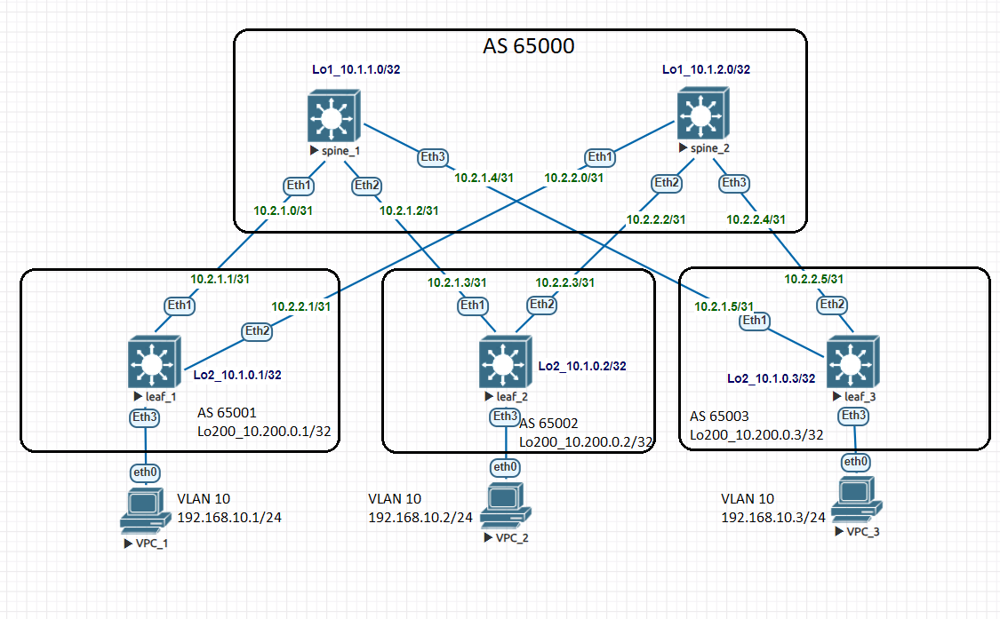

# Домашнее задание №5

## Overlay. VxLAN EVPN L2

### Задача:

- Настроить BGP peering между Leaf и Spine в AF l2vpn evpn
- Проверить связанность между клиентами

## Выполнение:

### Схема сети



### Конфигурация оборудования

- #### [leaf_1](config/leaf_1.conf)

```
service routing protocols model multi-agent
!
interface Ethernet3
   description to-vpc_1
   switchport access vlan 10
!
interface Loopback2
   ip address 10.1.0.1/32
!
interface Loopback200
   ip address 10.200.0.1/32
!
interface Vxlan1
   vxlan source-interface Loopback200
   vxlan vlan 10 vni 10010
!
ip routing
!
ip prefix-list loop
   seq 10 permit 10.1.0.1/32
   seq 20 permit 10.200.0.1/32
!
route-map connect permit 10
   match ip address prefix-list loop
!
router bgp 65001
   router-id 10.1.0.1
   neighbor evpn peer group
   neighbor evpn remote-as 65000
   neighbor evpn update-source Loopback2
   neighbor evpn ebgp-multihop 3
   neighbor evpn send-community extended
   neighbor spine peer group
   neighbor spine remote-as 65000
   neighbor spine bfd
   neighbor 10.1.1.0 peer group evpn
   neighbor 10.1.2.0 peer group evpn
   neighbor 10.2.1.0 peer group spine
   neighbor 10.2.2.0 peer group spine
   redistribute connected route-map connect
   !
   vlan 10
      rd 65001:10010
      route-target both 10:10010
      redistribute learned
   !
   address-family evpn
      neighbor evpn activate
   !
   address-family ipv4
      neighbor spine activate
```

- #### [leaf_2](config/leaf_2.conf)

```
service routing protocols model multi-agent
!
interface Ethernet3
   description to-vpc_2
   switchport access vlan 10
!
interface Loopback2
   ip address 10.1.0.2/32
!
interface Loopback200
   ip address 10.200.0.2/32
!
interface Management1
!
interface Vxlan1
   vxlan source-interface Loopback200
   vxlan vlan 10 vni 10010
!
ip routing
!
ip prefix-list loop
   seq 10 permit 10.1.0.2/32
   seq 20 permit 10.200.0.2/32
!
route-map connect permit 10
   match ip address prefix-list loop
!
router bgp 65002
   router-id 10.1.0.2
   neighbor evpn peer group
   neighbor evpn remote-as 65000
   neighbor evpn update-source Loopback2
   neighbor evpn ebgp-multihop 3
   neighbor evpn send-community extended
   neighbor spine peer group
   neighbor spine remote-as 65000
   neighbor spine bfd
   neighbor 10.1.1.0 peer group evpn
   neighbor 10.1.2.0 peer group evpn
   neighbor 10.2.1.2 peer group spine
   neighbor 10.2.2.2 peer group spine
   redistribute connected route-map connect
   !
   vlan 10
      rd 65002:10010
      route-target both 10:10010
      redistribute learned
   !
   address-family evpn
      neighbor evpn activate
   !
   address-family ipv4
      neighbor spine activate
```

- #### [leaf_3](config/leaf_3.conf)

```
service routing protocols model multi-agent
!
interface Ethernet3
   description to-vpc_3
   switchport access vlan 100
!
interface Loopback1
   ip address 10.1.0.3/32
!
interface Loopback200
   ip address 10.200.0.3/32
!
interface Management1
!
interface Vxlan1
   vxlan source-interface Loopback200
   vxlan vlan 10 vni 10010
!
ip routing
!
ip prefix-list loop
   seq 10 permit 10.1.0.3/32
   seq 20 permit 10.200.0.3/32
!
route-map connect permit 10
   match ip address prefix-list loop
!
router bgp 65003
   router-id 10.1.0.3
   neighbor evpn peer group
   neighbor evpn remote-as 65000
   neighbor evpn update-source Loopback2
   neighbor evpn ebgp-multihop 3
   neighbor evpn send-community extended
   neighbor spine peer group
   neighbor spine remote-as 65000
   neighbor spine bfd
   neighbor 10.1.1.0 peer group evpn
   neighbor 10.1.2.0 peer group evpn
   neighbor 10.2.1.4 peer group spine
   neighbor 10.2.2.4 peer group spine
   redistribute connected route-map connect
   !
   vlan 10
      rd 65003:10010
      route-target both 10:10010
      redistribute learned
   !
   address-family evpn
      neighbor evpn activate
   !
   address-family ipv4
      neighbor spine activate
```

- #### [spine_1](config/spine_1.conf)

```
peer-filter evpn
   10 match as-range 65001-65003 result accept
!
peer-filter leaf
   10 match as-range 65001-65003 result accept
!
router bgp 65000
   router-id 10.1.1.0
   bgp listen range 10.1.0.0/24 peer-group evpn peer-filter evpn
   bgp listen range 10.2.1.0/24 peer-group leaf peer-filter leaf
   neighbor evpn peer group
   neighbor evpn update-source Loopback1
   neighbor evpn ebgp-multihop 3
   neighbor evpn send-community extended
   neighbor leaf peer group
   neighbor leaf bfd
   redistribute connected route-map connect
   !
   address-family evpn
      neighbor evpn activate
   !
   address-family ipv4
      neighbor leaf activate
```

- #### [spine_2](config/spine_2.conf)

```
peer-filter evpn
   10 match as-range 65001-65003 result accept
!
peer-filter leaf
   10 match as-range 65001-65003 result accept
!
router bgp 65000
   router-id 10.1.2.0
   bgp listen range 10.1.0.0/24 peer-group evpn peer-filter evpn
   bgp listen range 10.2.2.0/24 peer-group leaf peer-filter leaf
   neighbor evpn peer group
   neighbor evpn update-source Loopback1
   neighbor evpn ebgp-multihop 3
   neighbor evpn send-community extended
   neighbor leaf peer group
   neighbor leaf bfd
   redistribute connected route-map connect
   !
   address-family evpn
      neighbor evpn activate
   !
   address-family ipv4
      neighbor leaf activate
```
---

### Проверка связанности клиентов по L2

- #### spine_1

```
spine_1#sh bgp evpn summary
BGP summary information for VRF default
Router identifier 10.1.1.0, local AS number 65000
Neighbor Status Codes: m - Under maintenance
  Neighbor V AS           MsgRcvd   MsgSent  InQ OutQ  Up/Down State   PfxRcd PfxAcc
  10.1.0.1 4 65001            102       100    0    0 01:07:02 Estab   1      1
  10.1.0.2 4 65002            103        96    0    0 01:07:02 Estab   1      1
  10.1.0.3 4 65003             96        89    0    0 00:59:03 Estab   1      1


```

- #### spine_2

```
spine_2#sh bgp evpn summary
BGP summary information for VRF default
Router identifier 10.1.2.0, local AS number 65000
Neighbor Status Codes: m - Under maintenance
  Neighbor V AS           MsgRcvd   MsgSent  InQ OutQ  Up/Down State   PfxRcd PfxA       cc
  10.1.0.1 4 65001             82        79    0    0 00:51:46 Estab   1      1
  10.1.0.2 4 65002             80        74    0    0 00:51:43 Estab   1      1
  10.1.0.3 4 65003             81        79    0    0 00:51:54 Estab   1      1

```

- #### leaf_1

```
leaf_1#sh ip route
 C        10.1.0.1/32 is directly connected, Loopback2
 B E      10.1.0.2/32 [200/0] via 10.2.1.0, Ethernet1
 B E      10.1.0.3/32 [200/0] via 10.2.1.0, Ethernet1
 B E      10.1.1.0/32 [200/0] via 10.2.1.0, Ethernet1
 B E      10.1.2.0/32 [200/0] via 10.2.2.0, Ethernet2
 C        10.2.1.0/31 is directly connected, Ethernet1
 C        10.2.2.0/31 is directly connected, Ethernet2
 C        10.200.0.1/32 is directly connected, Loopback200
 B E      10.200.0.2/32 [200/0] via 10.2.1.0, Ethernet1
 B E      10.200.0.3/32 [200/0] via 10.2.1.0, Ethernet1


leaf_1#sh ip bgp summary
BGP summary information for VRF default
Router identifier 10.1.0.1, local AS number 65001
Neighbor Status Codes: m - Under maintenance
  Neighbor V AS           MsgRcvd   MsgSent  InQ OutQ  Up/Down State   PfxRcd PfxAcc
  10.1.1.0 4 65000            230       214    0    0 01:09:01 Estab   5      5
  10.1.2.0 4 65000             98       110    0    0 00:52:56 Estab   5      5
  10.2.1.0 4 65000            375       420    0    0 02:04:19 Estab   5      5
  10.2.2.0 4 65000            292       353    0    0 00:53:07 Estab   5      5


leaf_1#sh vxlan vtep
Remote VTEPS for Vxlan1:

VTEP             Tunnel Type(s)
---------------- --------------
10.200.0.2       flood, unicast
10.200.0.3       flood, unicast

Total number of remote VTEPS:  2


leaf_1#sh bg evpn route-type mac-ip
BGP routing table information for VRF default
Router identifier 10.1.0.1, local AS number 65001
Route status codes: * - valid, > - active, S - Stale, E - ECMP head, e - ECMP
                    c - Contributing to ECMP, % - Pending BGP convergence
Origin codes: i - IGP, e - EGP, ? - incomplete
AS Path Attributes: Or-ID - Originator ID, C-LST - Cluster List, LL Nexthop - Link Local Nexthop

          Network                Next Hop              Metric  LocPref Weight  Path
 * >      RD: 65001:10010 mac-ip 0050.7966.6806
                                 -                     -       -       0       i
 * >Ec    RD: 65002:10010 mac-ip 0050.7966.6807
                                 10.200.0.2            -       100     0       65000 65002 i
 *  ec    RD: 65002:10010 mac-ip 0050.7966.6807
                                 10.200.0.2            -       100     0       65000 65002 i
 * >Ec    RD: 65003:10010 mac-ip 0050.7966.6808
                                 10.200.0.3            -       100     0       65000 65003 i
 *  ec    RD: 65003:10010 mac-ip 0050.7966.6808
                                 10.200.0.3            -       100     0       65000 65003 i


leaf_1#sh interfaces vxlan 1
Vxlan1 is up, line protocol is up (connected)
  Hardware is Vxlan
  Source interface is Loopback200 and is active with 10.200.0.1
  Listening on UDP port 4789
  Replication/Flood Mode is headend with Flood List Source: EVPN
  Remote MAC learning via EVPN
  VNI mapping to VLANs
  Static VLAN to VNI mapping is
    [10, 10010]
  Note: All Dynamic VLANs used by VCS are internal VLANs.
        Use 'show vxlan vni' for details.
  Static VRF to VNI mapping is not configured
  Headend replication flood vtep list is:
    10 10.200.0.3      10.200.0.2
  Shared Router MAC is 0000.0000.0000
  
 leaf_1#show vxlan vni
VNI to VLAN Mapping for Vxlan1
VNI         VLAN       Source       Interface       802.1Q Tag
----------- ---------- ------------ --------------- ----------
10010       10         static       Ethernet3       untagged
                                    Vxlan1          10

VNI to dynamic VLAN Mapping for Vxlan1
VNI       VLAN       VRF       Source
--------- ---------- --------- ------------


```

- #### leaf_2

```
leaf_2#sh ip bgp summary
BGP summary information for VRF default
Router identifier 10.1.0.2, local AS number 65002
Neighbor Status Codes: m - Under maintenance
  Neighbor V AS           MsgRcvd   MsgSent  InQ OutQ  Up/Down State   PfxRcd PfxAcc
  10.1.1.0 4 65000            255       286    0    0 00:07:00 Estab   5      5
  10.1.2.0 4 65000            109       122    0    0 01:04:39 Estab   5      5
  10.2.1.2 4 65000            395       414    0    0 02:03:53 Estab   5      5
  10.2.2.2 4 65000            306       366    0    0 01:04:53 Estab   5      5


leaf_2#show vxlan address-table
          Vxlan Mac Address Table
----------------------------------------------------------------------

VLAN  Mac Address     Type      Prt  VTEP             Moves   Last Move
----  -----------     ----      ---  ----             -----   ---------
  10  0050.7966.6806  EVPN      Vx1  10.200.0.1       1       0:07:06 ago
  10  0050.7966.6808  EVPN      Vx1  10.200.0.3       1       0:07:06 ago
Total Remote Mac Addresses for this criterion: 2


leaf_2#show bgp evpn route-type mac-ip
BGP routing table information for VRF default
Router identifier 10.1.0.2, local AS number 65002
Route status codes: * - valid, > - active, S - Stale, E - ECMP head, e - ECMP
                    c - Contributing to ECMP, % - Pending BGP convergence
Origin codes: i - IGP, e - EGP, ? - incomplete
AS Path Attributes: Or-ID - Originator ID, C-LST - Cluster List, LL Nexthop - Link Local Nexthop

          Network                Next Hop              Metric  LocPref Weight  Path
 * >Ec    RD: 65001:10010 mac-ip 0050.7966.6806
                                 10.200.0.1            -       100     0       65000 65001 i
 *  ec    RD: 65001:10010 mac-ip 0050.7966.6806
                                 10.200.0.1            -       100     0       65000 65001 i
 * >      RD: 65002:10010 mac-ip 0050.7966.6807
                                 -                     -       -       0       i
 * >Ec    RD: 65003:10010 mac-ip 0050.7966.6808
                                 10.200.0.3            -       100     0       65000 65003 i
 *  ec    RD: 65003:10010 mac-ip 0050.7966.6808
                                 10.200.0.3            -       100     0       65000 65003 i


leaf_2#sh interfaces vxlan 1
Vxlan1 is up, line protocol is up (connected)
  Hardware is Vxlan
  Source interface is Loopback200 and is active with 10.200.0.2
  Listening on UDP port 4789
  Replication/Flood Mode is headend with Flood List Source: EVPN
  Remote MAC learning via EVPN
  VNI mapping to VLANs
  Static VLAN to VNI mapping is
    [10, 10010]
  Note: All Dynamic VLANs used by VCS are internal VLANs.
        Use 'show vxlan vni' for details.
  Static VRF to VNI mapping is not configured
  Headend replication flood vtep list is:
    10 10.200.0.3      10.200.0.1
  Shared Router MAC is 0000.0000.0000

  
leaf_2#show vxlan vni
VNI to VLAN Mapping for Vxlan1
VNI         VLAN       Source       Interface       802.1Q Tag
----------- ---------- ------------ --------------- ----------
10010       10         static       Ethernet3       untagged
                                    Vxlan1          10

VNI to dynamic VLAN Mapping for Vxlan1
VNI       VLAN       VRF       Source
--------- ---------- --------- ------------

```

- #### leaf_3

```
leaf_3#sh ip bgp summary
BGP summary information for VRF default
Router identifier 10.1.0.3, local AS number 65003
Neighbor Status Codes: m - Under maintenance
  Neighbor V AS           MsgRcvd   MsgSent  InQ OutQ  Up/Down State   PfxRcd PfxAcc
  10.1.1.0 4 65000            136       142    0    0 00:09:13 Estab   5      5
  10.1.2.0 4 65000            110       122    0    0 01:07:04 Estab   5      5
  10.2.1.4 4 65000             95        99    0    0 01:15:06 Estab   5      5
  10.2.2.4 4 65000            100       103    0    0 01:07:07 Estab   5      5


leaf_3#show vxlan address-table
          Vxlan Mac Address Table
----------------------------------------------------------------------

VLAN  Mac Address     Type      Prt  VTEP             Moves   Last Move
----  -----------     ----      ---  ----             -----   ---------
  10  0050.7966.6806  EVPN      Vx1  10.200.0.1       1       0:09:02 ago
  10  0050.7966.6807  EVPN      Vx1  10.200.0.2       1       0:05:13 ago
Total Remote Mac Addresses for this criterion: 2


leaf_3#show bgp evpn route-type mac-ip
BGP routing table information for VRF default
Router identifier 10.1.0.3, local AS number 65003
Route status codes: * - valid, > - active, S - Stale, E - ECMP head, e - ECMP
                    c - Contributing to ECMP, % - Pending BGP convergence
Origin codes: i - IGP, e - EGP, ? - incomplete
AS Path Attributes: Or-ID - Originator ID, C-LST - Cluster List, LL Nexthop - Link Local Nexthop

          Network                Next Hop              Metric  LocPref Weight  Path
 * >Ec    RD: 65001:10010 mac-ip 0050.7966.6806
                                 10.200.0.1            -       100     0       65000 65001 i
 *  ec    RD: 65001:10010 mac-ip 0050.7966.6806
                                 10.200.0.1            -       100     0       65000 65001 i
 * >Ec    RD: 65002:10010 mac-ip 0050.7966.6807
                                 10.200.0.2            -       100     0       65000 65002 i
 *  ec    RD: 65002:10010 mac-ip 0050.7966.6807
                                 10.200.0.2            -       100     0       65000 65002 i
 * >      RD: 65003:10010 mac-ip 0050.7966.6808
                                 -                     -       -       0       i

leaf_3#sh interfaces vxlan 1
Vxlan1 is up, line protocol is up (connected)
  Hardware is Vxlan
  Source interface is Loopback200 and is active with 10.200.0.3
  Listening on UDP port 4789
  Replication/Flood Mode is headend with Flood List Source: EVPN
  Remote MAC learning via EVPN
  VNI mapping to VLANs
  Static VLAN to VNI mapping is
    [10, 10010]
  Note: All Dynamic VLANs used by VCS are internal VLANs.
        Use 'show vxlan vni' for details.
  Static VRF to VNI mapping is not configured
  Headend replication flood vtep list is:
    10 10.200.0.1      10.200.0.2
  Shared Router MAC is 0000.0000.0000


leaf_3#show vxlan vni
VNI to VLAN Mapping for Vxlan1
VNI         VLAN       Source       Interface       802.1Q Tag
----------- ---------- ------------ --------------- ----------
10010       10         static       Ethernet3       untagged
                                    Vxlan1          10

VNI to dynamic VLAN Mapping for Vxlan1
VNI       VLAN       VRF       Source
--------- ---------- --------- ------------

```
- #### VPC_1

```
VPCS> ping 192.168.10.2

84 bytes from 192.168.10.2 icmp_seq=1 ttl=64 time=17.634 ms
84 bytes from 192.168.10.2 icmp_seq=2 ttl=64 time=17.410 ms
84 bytes from 192.168.10.2 icmp_seq=3 ttl=64 time=24.810 ms
84 bytes from 192.168.10.2 icmp_seq=4 ttl=64 time=16.550 ms
84 bytes from 192.168.10.2 icmp_seq=5 ttl=64 time=18.299 ms


VPCS> ping 192.168.10.3

84 bytes from 192.168.10.3 icmp_seq=1 ttl=64 time=17.331 ms
84 bytes from 192.168.10.3 icmp_seq=2 ttl=64 time=16.660 ms
84 bytes from 192.168.10.3 icmp_seq=3 ttl=64 time=16.364 ms
84 bytes from 192.168.10.3 icmp_seq=4 ttl=64 time=17.650 ms
84 bytes from 192.168.10.3 icmp_seq=5 ttl=64 time=20.054 ms

```

- #### VPC_2

```
VPCS> ping 192.168.10.1

84 bytes from 192.168.10.1 icmp_seq=1 ttl=64 time=17.911 ms
84 bytes from 192.168.10.1 icmp_seq=2 ttl=64 time=17.204 ms
84 bytes from 192.168.10.1 icmp_seq=3 ttl=64 time=17.042 ms
84 bytes from 192.168.10.1 icmp_seq=4 ttl=64 time=20.568 ms
84 bytes from 192.168.10.1 icmp_seq=5 ttl=64 time=24.048 ms

VPCS> ping 192.168.10.3

84 bytes from 192.168.10.3 icmp_seq=1 ttl=64 time=18.108 ms
84 bytes from 192.168.10.3 icmp_seq=2 ttl=64 time=17.889 ms
84 bytes from 192.168.10.3 icmp_seq=3 ttl=64 time=16.454 ms
84 bytes from 192.168.10.3 icmp_seq=4 ttl=64 time=17.265 ms
84 bytes from 192.168.10.3 icmp_seq=5 ttl=64 time=17.525 ms

```
