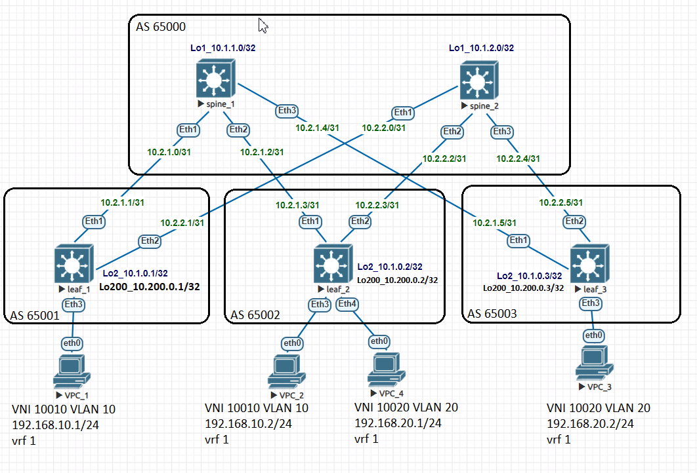

# Домашнее задание №6

## Overlay. VxLAN EVPN L3

### Задача:

- Настроить клиентов в разных VNI
- Настроить маршрутизацию между клиентами 
- Проверить связанность между клиентами

## Выполнение:

### Схема сети



### Конфигурация оборудования

- #### [leaf_1](config/leaf_1.conf)

```
vlan 10

vrf instance 1

interface Ethernet3
   description to-vpc_1
   switchport access vlan 10

interface Vlan10
   vrf 1
   ip address 192.168.10.254/24

interface Vxlan1
   vxlan source-interface Loopback200
   vxlan udp-port 4789
   vxlan vlan 10 vni 10010
   vxlan vrf 1 vni 1000
!
ip routing vrf 1  

router bgp 65001
   vlan 10
      rd 65001:10010
      route-target both 10:10010
      redistribute learned
   
   vrf 1
      rd 65001:1000
      route-target import evpn 1000:1000
      route-target export evpn 1000:1000

```

- #### [leaf_2](config/leaf_2.conf)

```
vlan 10,20

vrf instance 1

interface Ethernet4
   description to-vpc_4
   switchport access vlan 20

interface Vlan10
   vrf 1
   ip address virtual 192.168.10.254/24

interface Vlan20
   vrf 1
   ip address 192.168.20.254/24

interface Vxlan1
   vxlan source-interface Loopback200
   vxlan udp-port 4789
   vxlan vlan 10 vni 10010
   vxlan vlan 20 vni 10020
   vxlan vrf 1 vni 1000

ip routing vrf 1

router bgp 65002

   vlan 20
      rd 65002:10020
      route-target both 20:10020
      redistribute learned

   vrf 1
      rd 65002:1000
      route-target import evpn 1000:1000
      route-target export evpn 1000:1000
```

- #### [leaf_3](config/leaf_3.conf)

```
vlan 20

vrf instance 1

interface Ethernet3
   description to-vpc_3
   switchport access vlan 20

interface Vlan20
   vrf 1
   ip address virtual 192.168.20.254/24

interface Vxlan1
   vxlan source-interface Loopback200
   vxlan udp-port 4789
   vxlan vlan 20 vni 10020
   vxlan vrf 1 vni 1000

ip routing vrf 1

router bgp 65003

    vlan 20
      rd 65003:10020
      route-target both 20:10020
      redistribute learned

   vrf 1
      rd 65003:1000
      route-target import evpn 1000:1000
      route-target export evpn 1000:1000
```
---

### Проверка связанности клиентов по L3

- #### leaf_1

```
leaf_1#sh ip route vrf 1

B E      192.168.10.2/32 [200/0] via VTEP 10.200.0.2 VNI 1000 router-mac 50:00:00:cb:38:c2 local-interface Vxlan1
 C        192.168.10.0/24 is directly connected, Vlan10
 B E      192.168.20.2/32 [200/0] via VTEP 10.200.0.3 VNI 1000 router-mac 50:00:00:d5:5d:c0 local-interface Vxlan1

```
```
leaf_1#show bgp evpn route-type ip-prefix ipv4
BGP routing table information for VRF default
Router identifier 10.1.0.1, local AS number 65001
Route status codes: * - valid, > - active, S - Stale, E - ECMP head, e - ECMP
                    c - Contributing to ECMP, % - Pending BGP convergence
Origin codes: i - IGP, e - EGP, ? - incomplete
AS Path Attributes: Or-ID - Originator ID, C-LST - Cluster List, LL Nexthop - Link Local Nexthop

          Network                Next Hop              Metric  LocPref Weight  Path


```
```
leaf_1#sh bgp evpn route-type mac-ip
BGP routing table information for VRF default
Router identifier 10.1.0.1, local AS number 65001
Route status codes: * - valid, > - active, S - Stale, E - ECMP head, e - ECMP
                    c - Contributing to ECMP, % - Pending BGP convergence
Origin codes: i - IGP, e - EGP, ? - incomplete
AS Path Attributes: Or-ID - Originator ID, C-LST - Cluster List, LL Nexthop - Link Local Nexthop

          Network                Next Hop              Metric  LocPref Weight  Path
 * >      RD: 65001:10010 mac-ip 0050.7966.6806
                                 -                     -       -       0       i
 * >      RD: 65001:10010 mac-ip 0050.7966.6806 192.168.10.1
                                 -                     -       -       0       i
 * >Ec    RD: 65002:10010 mac-ip 0050.7966.6807
                                 10.200.0.2            -       100     0       65000 65002 i
 *  ec    RD: 65002:10010 mac-ip 0050.7966.6807
                                 10.200.0.2            -       100     0       65000 65002 i
 * >Ec    RD: 65002:10010 mac-ip 0050.7966.6807 192.168.10.2
                                 10.200.0.2            -       100     0       65000 65002 i
 *  ec    RD: 65002:10010 mac-ip 0050.7966.6807 192.168.10.2
                                 10.200.0.2            -       100     0       65000 65002 i
 * >Ec    RD: 65003:10020 mac-ip 0050.7966.6808
                                 10.200.0.3            -       100     0       65000 65003 i
 *  ec    RD: 65003:10020 mac-ip 0050.7966.6808
                                 10.200.0.3            -       100     0       65000 65003 i
 * >Ec    RD: 65003:10020 mac-ip 0050.7966.6808 192.168.20.2
                                 10.200.0.3            -       100     0       65000 65003 i
 *  ec    RD: 65003:10020 mac-ip 0050.7966.6808 192.168.20.2
                                 10.200.0.3            -       100     0       65000 65003 i
 * >Ec    RD: 65002:10020 mac-ip 0050.7966.6809
                                 10.200.0.2            -       100     0       65000 65002 i
 *  ec    RD: 65002:10020 mac-ip 0050.7966.6809
                                 10.200.0.2            -       100     0       65000 65002 i
```
```
leaf_1#sh arp vrf 1
Address         Age (sec)  Hardware Addr   Interface
192.168.10.1      0:03:56  0050.7966.6806  Vlan10, Ethernet3
192.168.10.2            -  0050.7966.6807  Vlan10, Vxlan1
```
```
leaf_1#sh interfaces vxlan 1
Vxlan1 is up, line protocol is up (connected)
  Hardware is Vxlan
  Source interface is Loopback200 and is active with 10.200.0.1
  Listening on UDP port 4789
  Replication/Flood Mode is headend with Flood List Source: EVPN
  Remote MAC learning via EVPN
  VNI mapping to VLANs
  Static VLAN to VNI mapping is
    [10, 10010]
  Dynamic VLAN to VNI mapping for 'evpn' is
    [4094, 1000]
  Note: All Dynamic VLANs used by VCS are internal VLANs.
        Use 'show vxlan vni' for details.
  Static VRF to VNI mapping is
   [1, 1000]
  Headend replication flood vtep list is:
    10 10.200.0.2
  Shared Router MAC is 0000.0000.0000

```
```  
leaf_1#show vxlan vni
VNI to VLAN Mapping for Vxlan1
VNI         VLAN       Source       Interface       802.1Q Tag
----------- ---------- ------------ --------------- ----------
10010       10         static       Ethernet3       untagged
                                    Vxlan1          10

VNI to dynamic VLAN Mapping for Vxlan1
VNI        VLAN       VRF       Source
---------- ---------- --------- ------------
1000       4094       1         evpn

```

- #### leaf_2

```
leaf_2#sh ip route vrf 1

 B E      192.168.10.1/32 [200/0] via VTEP 10.200.0.1 VNI 1000 router-mac 50:00:00:d7:ee:0b local-interface Vxlan1
 C        192.168.10.0/24 is directly connected, Vlan10
 B E      192.168.20.2/32 [200/0] via VTEP 10.200.0.3 VNI 1000 router-mac 50:00:00:d5:5d:c0 local-interface Vxlan1
 C        192.168.20.0/24 is directly connected, Vlan20

```
```
leaf_2#sh bgp evpn route-type mac-ip
BGP routing table information for VRF default
Router identifier 10.1.0.2, local AS number 65002
Route status codes: * - valid, > - active, S - Stale, E - ECMP head, e - ECMP
                    c - Contributing to ECMP, % - Pending BGP convergence
Origin codes: i - IGP, e - EGP, ? - incomplete
AS Path Attributes: Or-ID - Originator ID, C-LST - Cluster List, LL Nexthop - Link Local Nexthop

          Network                Next Hop              Metric  LocPref Weight  Path
 * >Ec    RD: 65001:10010 mac-ip 0050.7966.6806
                                 10.200.0.1            -       100     0       65000 65001 i
 *  ec    RD: 65001:10010 mac-ip 0050.7966.6806
                                 10.200.0.1            -       100     0       65000 65001 i
 * >Ec    RD: 65001:10010 mac-ip 0050.7966.6806 192.168.10.1
                                 10.200.0.1            -       100     0       65000 65001 i
 *  ec    RD: 65001:10010 mac-ip 0050.7966.6806 192.168.10.1
                                 10.200.0.1            -       100     0       65000 65001 i
 * >      RD: 65002:10010 mac-ip 0050.7966.6807
                                 -                     -       -       0       i
 * >      RD: 65002:10010 mac-ip 0050.7966.6807 192.168.10.2
                                 -                     -       -       0       i
 * >Ec    RD: 65003:10020 mac-ip 0050.7966.6808
                                 10.200.0.3            -       100     0       65000 65003 i
 *  ec    RD: 65003:10020 mac-ip 0050.7966.6808
                                 10.200.0.3            -       100     0       65000 65003 i
 * >Ec    RD: 65003:10020 mac-ip 0050.7966.6808 192.168.20.2
                                 10.200.0.3            -       100     0       65000 65003 i
 *  ec    RD: 65003:10020 mac-ip 0050.7966.6808 192.168.20.2
                                 10.200.0.3            -       100     0       65000 65003 i
```
```
leaf_2#show bgp evpn route-type ip-prefix ipv4
BGP routing table information for VRF default
Router identifier 10.1.0.2, local AS number 65002
Route status codes: * - valid, > - active, S - Stale, E - ECMP head, e - ECMP
                    c - Contributing to ECMP, % - Pending BGP convergence
Origin codes: i - IGP, e - EGP, ? - incomplete
AS Path Attributes: Or-ID - Originator ID, C-LST - Cluster List, LL Nexthop - Link Local Nexthop

          Network                Next Hop              Metric  LocPref Weight  Path
```
```
leaf_2#sh arp vrf 1
Address         Age (sec)  Hardware Addr   Interface
192.168.10.1            -  0050.7966.6806  Vlan10, Vxlan1
192.168.10.2      0:01:40  0050.7966.6807  Vlan10, Ethernet3
192.168.20.2            -  0050.7966.6808  Vlan20, Vxlan1
```
```
leaf_2#sh interfaces vxlan 1
Vxlan1 is up, line protocol is up (connected)
  Hardware is Vxlan
  Source interface is Loopback200 and is active with 10.200.0.2
  Listening on UDP port 4789
  Replication/Flood Mode is headend with Flood List Source: EVPN
  Remote MAC learning via EVPN
  VNI mapping to VLANs
  Static VLAN to VNI mapping is
    [10, 10010]       [20, 10020]
  Dynamic VLAN to VNI mapping for 'evpn' is
    [4094, 1000]
  Note: All Dynamic VLANs used by VCS are internal VLANs.
        Use 'show vxlan vni' for details.
  Static VRF to VNI mapping is
   [1, 1000]
  Headend replication flood vtep list is:
    10 10.200.0.1
    20 10.200.0.3
  Shared Router MAC is 0000.0000.0000
```
```  
leaf_2#show vxlan vni
VNI to VLAN Mapping for Vxlan1
VNI         VLAN       Source       Interface       802.1Q Tag
----------- ---------- ------------ --------------- ----------
10010       10         static       Ethernet3       untagged
                                    Vxlan1          10
10020       20         static       Ethernet4       untagged
                                    Vxlan1          20

VNI to dynamic VLAN Mapping for Vxlan1
VNI        VLAN       VRF       Source
---------- ---------- --------- ------------
1000       4094       1         evpn

```

- #### leaf_3

```
leaf_3(config-if-Vx1)#sh ip route vrf 1

 B E      192.168.10.1/32 [200/0] via VTEP 10.200.0.1 VNI 1000 router-mac 50:00:00:d7:ee:0b local-interface Vxlan1
 B E      192.168.10.2/32 [200/0] via VTEP 10.200.0.2 VNI 1000 router-mac 50:00:00:cb:38:c2 local-interface Vxlan1
 C        192.168.20.0/24 is directly connected, Vlan20

```
```
leaf_3(config-if-Vx1)#sh bgp evpn route-type mac-ip
BGP routing table information for VRF default
Router identifier 10.1.0.3, local AS number 65003
Route status codes: * - valid, > - active, S - Stale, E - ECMP head, e - ECMP
                    c - Contributing to ECMP, % - Pending BGP convergence
Origin codes: i - IGP, e - EGP, ? - incomplete
AS Path Attributes: Or-ID - Originator ID, C-LST - Cluster List, LL Nexthop - Link Local Nexthop

          Network                Next Hop              Metric  LocPref Weight  Path
 * >Ec    RD: 65001:10010 mac-ip 0050.7966.6806
                                 10.200.0.1            -       100     0       65000 65001 i
 *  ec    RD: 65001:10010 mac-ip 0050.7966.6806
                                 10.200.0.1            -       100     0       65000 65001 i
 * >Ec    RD: 65001:10010 mac-ip 0050.7966.6806 192.168.10.1
                                 10.200.0.1            -       100     0       65000 65001 i
 *  ec    RD: 65001:10010 mac-ip 0050.7966.6806 192.168.10.1
                                 10.200.0.1            -       100     0       65000 65001 i
 * >Ec    RD: 65002:10010 mac-ip 0050.7966.6807
                                 10.200.0.2            -       100     0       65000 65002 i
 *  ec    RD: 65002:10010 mac-ip 0050.7966.6807
                                 10.200.0.2            -       100     0       65000 65002 i
 * >Ec    RD: 65002:10010 mac-ip 0050.7966.6807 192.168.10.2
                                 10.200.0.2            -       100     0       65000 65002 i
 *  ec    RD: 65002:10010 mac-ip 0050.7966.6807 192.168.10.2
                                 10.200.0.2            -       100     0       65000 65002 i
 * >      RD: 65003:10020 mac-ip 0050.7966.6808
                                 -                     -       -       0       i
 * >      RD: 65003:10020 mac-ip 0050.7966.6808 192.168.20.2
                                 -                     -       -       0       i
```
```
leaf_3(config-if-Vx1)#sh bgp evpn route-type ip-prefix ipv4
BGP routing table information for VRF default
Router identifier 10.1.0.3, local AS number 65003
Route status codes: * - valid, > - active, S - Stale, E - ECMP head, e - ECMP
                    c - Contributing to ECMP, % - Pending BGP convergence
Origin codes: i - IGP, e - EGP, ? - incomplete
AS Path Attributes: Or-ID - Originator ID, C-LST - Cluster List, LL Nexthop - Link Local Nexthop

          Network                Next Hop              Metric  LocPref Weight  Path
```
```
leaf_3#sh ip arp vrf 1
Address         Age (sec)  Hardware Addr   Interface
192.168.20.1            -  0050.7966.6809  Vlan20, Vxlan1
192.168.20.2      0:00:02  0050.7966.6808  Vlan20, Ethernet3

```
```
leaf_3#sh interfaces vxlan 1
Vxlan1 is up, line protocol is up (connected)
  Hardware is Vxlan
  Source interface is Loopback200 and is active with 10.200.0.3
  Listening on UDP port 4789
  Replication/Flood Mode is headend with Flood List Source: EVPN
  Remote MAC learning via EVPN
  VNI mapping to VLANs
  Static VLAN to VNI mapping is
    [20, 10020]
  Dynamic VLAN to VNI mapping for 'evpn' is
    [4094, 1000]
  Note: All Dynamic VLANs used by VCS are internal VLANs.
        Use 'show vxlan vni' for details.
  Static VRF to VNI mapping is
   [1, 1000]
  Headend replication flood vtep list is:
    20 10.200.0.2
  Shared Router MAC is 0000.0000.0000
```
```
leaf_3#show vxlan vni
VNI to VLAN Mapping for Vxlan1
VNI         VLAN       Source       Interface       802.1Q Tag
----------- ---------- ------------ --------------- ----------
10020       20         static       Ethernet3       untagged
                                    Vxlan1          20

VNI to dynamic VLAN Mapping for Vxlan1
VNI        VLAN       VRF       Source
---------- ---------- --------- ------------
1000       4094       1         evpn
```

- #### VPC_1

```
VPCS> ping 192.168.10.2

84 bytes from 192.168.10.2 icmp_seq=1 ttl=64 time=112.561 ms
84 bytes from 192.168.10.2 icmp_seq=2 ttl=64 time=17.127 ms

VPCS> ping 192.168.20.1

84 bytes from 192.168.20.1 icmp_seq=1 ttl=62 time=27.096 ms
84 bytes from 192.168.20.1 icmp_seq=2 ttl=62 time=18.514 ms

VPCS> ping 192.168.20.2

84 bytes from 192.168.20.2 icmp_seq=1 ttl=62 time=20.796 ms
84 bytes from 192.168.20.2 icmp_seq=2 ttl=62 time=19.112 ms
```

- #### VPC_2

```
VPCS> ping 192.168.10.1

84 bytes from 192.168.10.1 icmp_seq=1 ttl=64 time=18.348 ms
84 bytes from 192.168.10.1 icmp_seq=2 ttl=64 time=18.195 ms

VPCS> ping 192.168.20.1

84 bytes from 192.168.20.1 icmp_seq=1 ttl=63 time=15.164 ms
84 bytes from 192.168.20.1 icmp_seq=2 ttl=63 time=9.897 ms

VPCS> ping 192.168.20.2

84 bytes from 192.168.20.2 icmp_seq=1 ttl=62 time=27.993 ms
84 bytes from 192.168.20.2 icmp_seq=2 ttl=62 time=21.144 ms

```