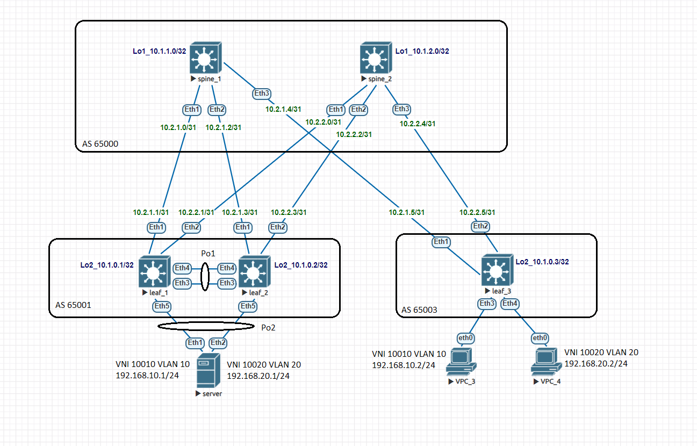

# Домашнее задание №7

## Overlay. VxLAN VPC

### Задача:

- Подключить клиентов 2-я линками к разным Leaf
- Настроить агрегированный канал со стороны клиента 
- Настроить VPC для работы в Overlay сети
- Проверить связанность между клиентами

## Выполнение:

### Схема сети



### Конфигурация оборудования

- #### [leaf_1](config/leaf_1.conf)

```
vlan 10,20,100

vrf instance 1

interface Port-Channel1
   description mlag
   switchport trunk allowed vlan 100
   switchport mode trunk

interface Port-Channel2
   description to-server
   switchport trunk allowed vlan 10,20
   switchport mode trunk
   mlag 2

interface Ethernet3
   channel-group 1 mode active

interface Ethernet4
   channel-group 1 mode active

interface Ethernet5
   channel-group 2 mode active

interface Vlan10
   vrf 1
   ip address virtual 192.168.10.254/24

interface Vlan20
   vrf 1
   ip address virtual 192.168.20.254/24

interface Vlan100
   ip address 10.100.100.0/31

interface Vxlan1
   vxlan source-interface Loopback200
   vxlan udp-port 4789
   vxlan vlan 10 vni 10010
   vxlan vlan 20 vni 10020
   vxlan vrf 1 vni 1000

ip routing vrf 1

mlag configuration
   domain-id 1
   local-interface Vlan100
   peer-address 10.100.100.1
   peer-link Port-Channel1

router bgp 65001

   vlan 10
      rd 65001:10010
      route-target both 10:10010
      redistribute learned
   
   vlan 20
      rd 65001:10020
      route-target both 20:10020
      redistribute learned
```

- #### [leaf_2](config/leaf_2.conf)

```
spanning-tree mode mstp
no spanning-tree vlan-id 4094

vlan 10,20,100

vrf instance 1

interface Port-Channel1
   description mlag
   switchport trunk allowed vlan 100
   switchport mode trunk

interface Port-Channel2
   description to-server
   switchport trunk allowed vlan 10,20
   switchport mode trunk
   mlag 2

interface Ethernet3
   channel-group 1 mode active

interface Ethernet4
   channel-group 1 mode active

interface Ethernet5
   channel-group 2 mode active

interface Vlan10
   vrf 1
   ip address virtual 192.168.10.254/24

interface Vlan20
   vrf 1
   ip address virtual 192.168.20.254/24

interface Vlan100
   ip address 10.100.100.1/31

interface Vxlan1
   vxlan source-interface Loopback200
   vxlan udp-port 4789
   vxlan vlan 10 vni 10010
   vxlan vlan 20 vni 10020
   vxlan vrf 1 vni 1000

ip routing vrf 1

mlag configuration
   domain-id 1
   local-interface Vlan100
   peer-address 10.100.100.0
   peer-link Port-Channel1

router bgp 65001

   vlan 10
      rd 65001:10010
      route-target both 10:10010
      redistribute learned
   
   vlan 20
      rd 65001:10020
      route-target both 20:10020
      redistribute learned

   vrf 1
      rd 65001:1000
      route-target import evpn 1000:1000
      route-target export evpn 1000:1000
```

- #### [leaf_3](config/leaf_3.conf)

```
vlan 10,20

vrf instance 1D

interface Ethernet3
   description to-vpc_3
   switchport access vlan 10

interface Ethernet4
   description to-vpc_4
   switchport access vlan 20

interface Vlan10
   vrf 1
   ip address virtual 192.168.10.254/24

interface Vlan20
   vrf 1
   ip address virtual 192.168.20.254/24

interface Vxlan1
   vxlan source-interface Loopback200
   vxlan udp-port 4789
   vxlan vlan 10 vni 10010
   vxlan vlan 20 vni 10020
   vxlan vrf 1 vni 1000

ip routing vrf 1

router bgp 65003

   vlan 10
      rd 65003:10010
      route-target both 10:10010
      redistribute learned
   
   vlan 20
      rd 65003:10020
      route-target both 20:10020
      redistribute learned

   vrf 1
      rd 65003:1000
      route-target import evpn 1000:1000
      route-target export evpn 1000:1000
```

- #### [server](config/server.conf)

```
vlan 10,20

interface Port-Channel2
   switchport trunk allowed vlan 10,20
   switchport mode trunk

interface Ethernet1
   channel-group 2 mode active

interface Ethernet2
   channel-group 2 mode active

interface Vlan10
   ip address 192.168.10.1/24

interface Vlan20
   ip address 192.168.20.1/24

ip routing
```
---

### Проверка связанности клиентов по L3

- #### leaf_1

```
leaf_1(config-router-bgp-vrf-1)#sh mlag
MLAG Configuration:
domain-id                          :                   1
local-interface                    :             Vlan100
peer-address                       :        10.100.100.1
peer-link                          :       Port-Channel1
peer-config                        :          consistent

MLAG Status:
state                              :              Active
negotiation status                 :           Connected
peer-link status                   :                  Up
local-int status                   :                  Up
system-id                          :   52:00:00:cb:38:c2
dual-primary detection             :            Disabled
dual-primary interface errdisabled :               False

MLAG Ports:
Disabled                           :                   0
Configured                         :                   0
Inactive                           :                   0
Active-partial                     :                   0
Active-full                        :                   1

```
```
leaf_1(config-router-bgp-vrf-1)#sh mlag interfaces detail
                                        local/remote
 mlag         state   local   remote    oper    config    last change   changes
------ ------------- ------- -------- ------- ---------- -------------- -------
    2   active-full     Po2      Po2   up/up   ena/ena    1:08:40 ago         6
```
```
leaf_1(config-router-bgp-vrf-1)#sh port-channel 2 detailed
Port Channel Port-Channel2 (Fallback State: Unconfigured):
Minimum links: unconfigured
Minimum speed: unconfigured
Current weight/Max weight: 1/16
  Active Ports:
      Port               Time Became Active      Protocol      Mode      Weight
    ------------------ ----------------------- ------------- ----------- ------
      Ethernet5          20:03:48                LACP          Active      1
      PeerEthernet5      20:03:49                LACP          Active      0
```
```
leaf_1(config-router-bgp-vrf-1)#sh bgp evpn
BGP routing table information for VRF default
Router identifier 10.1.0.1, local AS number 65001
Route status codes: * - valid, > - active, S - Stale, E - ECMP head, e - ECMP
                    c - Contributing to ECMP, % - Pending BGP convergence
Origin codes: i - IGP, e - EGP, ? - incomplete
AS Path Attributes: Or-ID - Originator ID, C-LST - Cluster List, LL Nexthop - Link Local Nexthop

          Network                Next Hop              Metric  LocPref Weight  Path
 * >Ec    RD: 65003:10020 mac-ip 0050.7966.6807
                                 10.200.0.3            -       100     0       65000 65003 i
 *  ec    RD: 65003:10020 mac-ip 0050.7966.6807
                                 10.200.0.3            -       100     0       65000 65003 i
 * >Ec    RD: 65003:10020 mac-ip 0050.7966.6807 192.168.20.2
                                 10.200.0.3            -       100     0       65000 65003 i
 *  ec    RD: 65003:10020 mac-ip 0050.7966.6807 192.168.20.2
                                 10.200.0.3            -       100     0       65000 65003 i
 * >Ec    RD: 65003:10010 mac-ip 0050.7966.6808
                                 10.200.0.3            -       100     0       65000 65003 i
 *  ec    RD: 65003:10010 mac-ip 0050.7966.6808
                                 10.200.0.3            -       100     0       65000 65003 i
 * >Ec    RD: 65003:10010 mac-ip 0050.7966.6808 192.168.10.2
                                 10.200.0.3            -       100     0       65000 65003 i
 *  ec    RD: 65003:10010 mac-ip 0050.7966.6808 192.168.10.2
                                 10.200.0.3            -       100     0       65000 65003 i
 * >      RD: 65001:10010 imet 10.200.0.1
                                 -                     -       -       0       i
 * >      RD: 65001:10020 imet 10.200.0.1
                                 -                     -       -       0       i
 * >Ec    RD: 65003:10010 imet 10.200.0.3
                                 10.200.0.3            -       100     0       65000 65003 i
 *  ec    RD: 65003:10010 imet 10.200.0.3
                                 10.200.0.3            -       100     0       65000 65003 i
 * >Ec    RD: 65003:10020 imet 10.200.0.3
                                 10.200.0.3            -       100     0       65000 65003 i
 *  ec    RD: 65003:10020 imet 10.200.0.3
                                 10.200.0.3            -       100     0       65000 65003 i
```
```
leaf_1(config-router-bgp-vrf-1)#sh ip route vrf 1

B E      192.168.10.2/32 [200/0] via VTEP 10.200.0.3 VNI 1000 router-mac 50:00:00:d5:5d:c0 local-interface Vxlan1
 C        192.168.10.0/24 is directly connected, Vlan10
 B E      192.168.20.2/32 [200/0] via VTEP 10.200.0.3 VNI 1000 router-mac 50:00:00:d5:5d:c0 local-interface Vxlan1
 C        192.168.20.0/24 is directly connected, Vlan20

```
```
leaf_1(config-router-bgp-vrf-1)#show vxlan address-table
          Vxlan Mac Address Table
----------------------------------------------------------------------

VLAN  Mac Address     Type      Prt  VTEP             Moves   Last Move
----  -----------     ----      ---  ----             -----   ---------
  10  0050.7966.6808  EVPN      Vx1  10.200.0.3       1       0:01:16 ago
  20  0050.7966.6807  EVPN      Vx1  10.200.0.3       1       0:01:29 ago
4094  5000.00d5.5dc0  EVPN      Vx1  10.200.0.3       1       0:01:29 ago
```
```
leaf_1(config-router-bgp-vrf-1)#show vxlan address-table
          Vxlan Mac Address Table
----------------------------------------------------------------------

VLAN  Mac Address     Type      Prt  VTEP             Moves   Last Move
----  -----------     ----      ---  ----             -----   ---------
  10  0050.7966.6808  EVPN      Vx1  10.200.0.3       1       0:01:16 ago
  20  0050.7966.6807  EVPN      Vx1  10.200.0.3       1       0:01:29 ago
4094  5000.00d5.5dc0  EVPN      Vx1  10.200.0.3       1       0:01:29 ago
Total Remote Mac Addresses for this criterion: 3
leaf_1(config-router-bgp-vrf-1)#sh interfaces vxlan 1
Vxlan1 is up, line protocol is up (connected)
  Hardware is Vxlan
  Source interface is Loopback200 and is active with 10.200.0.1
  Listening on UDP port 4789
  Replication/Flood Mode is headend with Flood List Source: EVPN
  Remote MAC learning via EVPN
  VNI mapping to VLANs
  Static VLAN to VNI mapping is
    [10, 10010]       [20, 10020]
  Dynamic VLAN to VNI mapping for 'evpn' is
    [4094, 1000]
  Note: All Dynamic VLANs used by VCS are internal VLANs.
        Use 'show vxlan vni' for details.
  Static VRF to VNI mapping is
   [1, 1000]
  Headend replication flood vtep list is:
    10 10.200.0.3
    20 10.200.0.3
  MLAG Shared Router MAC is 0000.0000.0000
```
```  
VNI to VLAN Mapping for Vxlan1
VNI         VLAN       Source       Interface           802.1Q Tag
----------- ---------- ------------ ------------------- ----------
10010       10         static       Port-Channel2       10
                                    Vxlan1              10
10020       20         static       Port-Channel2       20
                                    Vxlan1              20

VNI to dynamic VLAN Mapping for Vxlan1
VNI        VLAN       VRF       Source
---------- ---------- --------- ------------
1000       4094       1         evpn

```

- #### leaf_2

```
leaf_2#sh mlag
MLAG Configuration:
domain-id                          :                   1
local-interface                    :             Vlan100
peer-address                       :        10.100.100.0
peer-link                          :       Port-Channel1
peer-config                        :          consistent

MLAG Status:
state                              :              Active
negotiation status                 :           Connected
peer-link status                   :                  Up
local-int status                   :                  Up
system-id                          :   52:00:00:cb:38:c2
dual-primary detection             :            Disabled
dual-primary interface errdisabled :               False

MLAG Ports:
Disabled                           :                   0
Configured                         :                   0
Inactive                           :                   0
Active-partial                     :                   0
Active-full                        :                   1

```
```
leaf_2#sh mlag interfaces detail
                                        local/remote
 mlag         state   local   remote    oper    config    last change   changes
------ ------------- ------- -------- ------- ---------- -------------- -------
    2   active-full     Po2      Po2   up/up   ena/ena    1:14:57 ago         7

```
```
leaf_2#sh port-channel 2 detailed
Port Channel Port-Channel2 (Fallback State: Unconfigured):
Minimum links: unconfigured
Minimum speed: unconfigured
Current weight/Max weight: 1/16
  Active Ports:
      Port               Time Became Active      Protocol      Mode      Weight
    ------------------ ----------------------- ------------- ----------- ------
      Ethernet5          20:03:49                LACP          Active      1
      PeerEthernet5      20:03:48                LACP          Active      0

```
```
leaf_2#sh bgp evpn
BGP routing table information for VRF default
Router identifier 10.1.0.2, local AS number 65001
Route status codes: * - valid, > - active, S - Stale, E - ECMP head, e - ECMP
                    c - Contributing to ECMP, % - Pending BGP convergence
Origin codes: i - IGP, e - EGP, ? - incomplete
AS Path Attributes: Or-ID - Originator ID, C-LST - Cluster List, LL Nexthop - Link Local Nexthop

          Network                Next Hop              Metric  LocPref Weight  Path
 * >Ec    RD: 65003:10020 mac-ip 0050.7966.6807
                                 10.200.0.3            -       100     0       65000 65003 i
 *  ec    RD: 65003:10020 mac-ip 0050.7966.6807
                                 10.200.0.3            -       100     0       65000 65003 i
 * >Ec    RD: 65003:10020 mac-ip 0050.7966.6807 192.168.20.2
                                 10.200.0.3            -       100     0       65000 65003 i
 *  ec    RD: 65003:10020 mac-ip 0050.7966.6807 192.168.20.2
                                 10.200.0.3            -       100     0       65000 65003 i
 * >Ec    RD: 65003:10010 mac-ip 0050.7966.6808
                                 10.200.0.3            -       100     0       65000 65003 i
 *  ec    RD: 65003:10010 mac-ip 0050.7966.6808
                                 10.200.0.3            -       100     0       65000 65003 i
 * >Ec    RD: 65003:10010 mac-ip 0050.7966.6808 192.168.10.2
                                 10.200.0.3            -       100     0       65000 65003 i
 *  ec    RD: 65003:10010 mac-ip 0050.7966.6808 192.168.10.2
                                 10.200.0.3            -       100     0       65000 65003 i
 * >      RD: 65001:10010 mac-ip 5000.0072.8b31
                                 -                     -       -       0       i
 * >      RD: 65001:10020 mac-ip 5000.0072.8b31
                                 -                     -       -       0       i
 * >      RD: 65001:10010 imet 10.200.0.2
                                 -                     -       -       0       i
 * >      RD: 65001:10020 imet 10.200.0.2
                                 -                     -       -       0       i
 * >Ec    RD: 65003:10010 imet 10.200.0.3
                                 10.200.0.3            -       100     0       65000 65003 i
 *  ec    RD: 65003:10010 imet 10.200.0.3
                                 10.200.0.3            -       100     0       65000 65003 i
 * >Ec    RD: 65003:10020 imet 10.200.0.3
                                 10.200.0.3            -       100     0       65000 65003 i
 *  ec    RD: 65003:10020 imet 10.200.0.3
                                 10.200.0.3            -       100     0       65000 65003 i

```
```
leaf_2#sh ip route vrf 1

  B E      192.168.10.2/32 [200/0] via VTEP 10.200.0.3 VNI 1000 router-mac 50:00:00:d5:5d:c0 local-interface Vxlan1
 C        192.168.10.0/24 is directly connected, Vlan10
 B E      192.168.20.2/32 [200/0] via VTEP 10.200.0.3 VNI 1000 router-mac 50:00:00:d5:5d:c0 local-interface Vxlan1
 C        192.168.20.0/24 is directly connected, Vlan20

```
```
leaf_2#sh vxlan address-table
          Vxlan Mac Address Table
----------------------------------------------------------------------

VLAN  Mac Address     Type      Prt  VTEP             Moves   Last Move
----  -----------     ----      ---  ----             -----   ---------
  10  0050.7966.6808  EVPN      Vx1  10.200.0.3       1       0:01:33 ago
  20  0050.7966.6807  EVPN      Vx1  10.200.0.3       1       0:01:27 ago
4094  5000.00d5.5dc0  EVPN      Vx1  10.200.0.3       1       0:01:33 ago
Total Remote Mac Addresses for this criterion: 3
```
```
leaf_2#sh interfaces vxlan 1
Vxlan1 is up, line protocol is up (connected)
  Hardware is Vxlan
  Source interface is Loopback200 and is active with 10.200.0.2
  Listening on UDP port 4789
  Replication/Flood Mode is headend with Flood List Source: EVPN
  Remote MAC learning via EVPN
  VNI mapping to VLANs
  Static VLAN to VNI mapping is
    [10, 10010]       [20, 10020]
  Dynamic VLAN to VNI mapping for 'evpn' is
    [4094, 1000]
  Note: All Dynamic VLANs used by VCS are internal VLANs.
        Use 'show vxlan vni' for details.
  Static VRF to VNI mapping is
   [1, 1000]
  Headend replication flood vtep list is:
    10 10.200.0.3
    20 10.200.0.3
  MLAG Shared Router MAC is 0000.0000.0000
```
```  
leaf_2#show vxlan vni
VNI to VLAN Mapping for Vxlan1
VNI         VLAN       Source       Interface           802.1Q Tag
----------- ---------- ------------ ------------------- ----------
10010       10         static       Port-Channel2       10
                                    Vxlan1              10
10020       20         static       Port-Channel2       20
                                    Vxlan1              20

VNI to dynamic VLAN Mapping for Vxlan1
VNI        VLAN       VRF       Source
---------- ---------- --------- ------------
1000       4094       1         evpn
```

- #### leaf_3

```
leaf_3#sh ip route vrf 1

C        192.168.10.0/24 is directly connected, Vlan10
 C        192.168.20.0/24 is directly connected, Vlan20

```
```
leaf_3#sh bgp evpn route-type mac-ip
BGP routing table information for VRF default
Router identifier 10.1.0.3, local AS number 65003
Route status codes: * - valid, > - active, S - Stale, E - ECMP head, e - ECMP
                    c - Contributing to ECMP, % - Pending BGP convergence
Origin codes: i - IGP, e - EGP, ? - incomplete
AS Path Attributes: Or-ID - Originator ID, C-LST - Cluster List, LL Nexthop - Link Local Nexthop

          Network                Next Hop              Metric  LocPref Weight  Path
 * >      RD: 65003:10020 mac-ip 0050.7966.6807
                                 -                     -       -       0       i
 * >      RD: 65003:10020 mac-ip 0050.7966.6807 192.168.20.2
                                 -                     -       -       0       i
 * >      RD: 65003:10010 mac-ip 0050.7966.6808
                                 -                     -       -       0       i
 * >      RD: 65003:10010 mac-ip 0050.7966.6808 192.168.10.2
                                 -                     -       -       0       i
 * >Ec    RD: 65001:10010 mac-ip 5000.0072.8b31
                                 10.200.0.2            -       100     0       65000 65001 i
 *  ec    RD: 65001:10010 mac-ip 5000.0072.8b31
                                 10.200.0.2            -       100     0       65000 65001 i
 * >Ec    RD: 65001:10020 mac-ip 5000.0072.8b31
                                 10.200.0.2            -       100     0       65000 65001 i
 *  ec    RD: 65001:10020 mac-ip 5000.0072.8b31
                                 10.200.0.2            -       100     0       65000 65001 i

```
```
leaf_3#show vxlan address-table
          Vxlan Mac Address Table
----------------------------------------------------------------------

VLAN  Mac Address     Type      Prt  VTEP             Moves   Last Move
----  -----------     ----      ---  ----             -----   ---------
  10  5000.0072.8b31  EVPN      Vx1  10.200.0.2       1       0:04:12 ago
  20  5000.0072.8b31  EVPN      Vx1  10.200.0.2       1       0:04:06 ago
Total Remote Mac Addresses for this criterion: 2
```
```
leaf_3#sh interfaces vxlan 1
Vxlan1 is up, line protocol is up (connected)
  Hardware is Vxlan
  Source interface is Loopback200 and is active with 10.200.0.3
  Listening on UDP port 4789
  Replication/Flood Mode is headend with Flood List Source: EVPN
  Remote MAC learning via EVPN
  VNI mapping to VLANs
  Static VLAN to VNI mapping is
    [10, 10010]       [20, 10020]
  Dynamic VLAN to VNI mapping for 'evpn' is
    [4094, 1000]
  Note: All Dynamic VLANs used by VCS are internal VLANs.
        Use 'show vxlan vni' for details.
  Static VRF to VNI mapping is
   [1, 1000]
  Headend replication flood vtep list is:
    10 10.200.0.1      10.200.0.2
    20 10.200.0.1      10.200.0.2
  Shared Router MAC is 0000.0000.0000
```
```
leaf_3#show vxlan vni
VNI to VLAN Mapping for Vxlan1
VNI         VLAN       Source       Interface       802.1Q Tag
----------- ---------- ------------ --------------- ----------
10010       10         static       Ethernet3       untagged
                                    Vxlan1          10
10020       20         static       Ethernet4       untagged
                                    Vxlan1          20

VNI to dynamic VLAN Mapping for Vxlan1
VNI        VLAN       VRF       Source
---------- ---------- --------- ------------
1000       4094       1         evpn
```

- #### server-1

```
server#sh port-channel 2 detailed
Port Channel Port-Channel2 (Fallback State: Unconfigured):
Minimum links: unconfigured
Minimum speed: unconfigured
Current weight/Max weight: 2/16
  Active Ports:
       Port            Time Became Active       Protocol       Mode      Weight
    --------------- ------------------------ -------------- ------------ ------
       Ethernet1       20:03:46                 LACP           Active      1
       Ethernet2       20:03:48                 LACP           Active      1

```

- #### VPC_3

```
VPCS> ping 192.168.10.1

84 bytes from 192.168.10.1 icmp_seq=1 ttl=64 time=29.093 ms
84 bytes from 192.168.10.1 icmp_seq=2 ttl=64 time=23.913 ms

VPCS> ping 192.168.20.1

84 bytes from 192.168.20.1 icmp_seq=1 ttl=64 time=24.467 ms
84 bytes from 192.168.20.1 icmp_seq=2 ttl=64 time=25.031 ms

VPCS> ping 192.168.20.2

84 bytes from 192.168.20.2 icmp_seq=1 ttl=63 time=14.465 ms
84 bytes from 192.168.20.2 icmp_seq=2 ttl=63 time=8.941 ms


```

- #### VPC_4

```
VPCS> ping 192.168.10.1

84 bytes from 192.168.10.1 icmp_seq=1 ttl=64 time=50.234 ms
84 bytes from 192.168.10.1 icmp_seq=2 ttl=64 time=27.009 ms

VPCS> ping 192.168.20.1

84 bytes from 192.168.20.1 icmp_seq=1 ttl=64 time=29.664 ms
84 bytes from 192.168.20.1 icmp_seq=2 ttl=64 time=27.919 ms

VPCS> ping 192.168.10.2

84 bytes from 192.168.10.2 icmp_seq=1 ttl=63 time=9.230 ms
84 bytes from 192.168.10.2 icmp_seq=2 ttl=63 time=9.177 ms
```