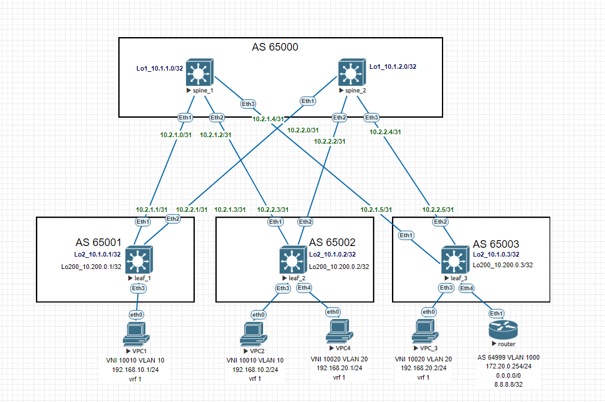

# Домашнее задание №8

## Overlay. VxLAN Оптимизация таблиц маршрутизации 

### Задача:

- Анонсировать суммарные префиксы клиентов в Overlay сети
- Настроить маршрутизацию между клиентами через суммарный префикс
- Проверить связанность между клиентами

## Выполнение:

### Схема сети



### Конфигурация оборудования

- #### [leaf_1](config/leaf_1.conf)

```
vlan 10

vrf instance 1

interface Ethernet3
   description to-vpc_1
   switchport access vlan 10

interface Vlan10
   vrf 1
   ip address virtual 192.168.10.254/24

interface Vxlan1
   vxlan source-interface Loopback200
   vxlan udp-port 4789
   vxlan vlan 10 vni 10010
   vxlan vrf 1 vni 1000

ip routing vrf 1

router bgp 65001

   vlan 10
      rd 65001:10010
      route-target both 10:10010
      redistribute learned

    vrf 1
      rd 65001:1000
      route-target import evpn 1000:1000
      route-target export evpn 1000:1000
```

- #### [leaf_2](config/leaf_2.conf)

```
vlan 10,20

interface Ethernet3
   description to-vpc_2
   switchport access vlan 10

interface Ethernet4
   description to-vpc_4
   switchport access vlan 20

interface Vlan10
   vrf 1
   ip address virtual 192.168.10.254/24

interface Vlan20
   vrf 1
   ip address virtual 192.168.20.254/24

interface Vxlan1
   vxlan source-interface Loopback200
   vxlan udp-port 4789
   vxlan vlan 10 vni 10010
   vxlan vlan 20 vni 10020
   vxlan vrf 1 vni 1000

ip routing vrf 1

router bgp 65002

    vlan 10
      rd 65002:10010
      route-target both 10:10010
      redistribute learned
   
    vlan 20
      rd 65002:10020
      route-target both 20:10020
      redistribute learned

   vrf 1
      rd 65002:1000
      route-target import evpn 1000:1000
      route-target export evpn 1000:1000
```

- #### [leaf_3](config/leaf_3.conf)

```
vlan 20,1000

vrf instance 1

interface Ethernet3
   description to-vpc_3
   switchport access vlan 20

interface Ethernet4
   description to-router
   switchport trunk allowed vlan 1000
   switchport mode trunk

interface Vlan20
   vrf 1
   ip address virtual 192.168.20.254/24

interface Vlan1000
   description to-router
   vrf 1
   ip address 172.20.0.3/24

interface Vxlan1
   vxlan source-interface Loopback200
   vxlan udp-port 4789
   vxlan vlan 20 vni 10020
   vxlan vrf 1 vni 1000

ip routing vrf 1

router bgp 65003

   vlan 20
      rd 65003:10020
      route-target both 20:10020
      redistribute learned

   vrf 1
      rd 65003:1000
      route-target import evpn 1000:1000
      route-target export evpn 1000:1000
      neighbor 172.20.0.254 remote-as 64999
      redistribute connected
      !
      address-family ipv4
         neighbor 172.20.0.254 activate
```

- #### [router](config/router.conf)

```
vlan 1000

interface Ethernet1
   description to-leaf_3
   switchport trunk allowed vlan 1000
   switchport mode trunk

interface Ethernet2

interface Ethernet3

interface Loopback0
   ip address 10.100.0.1/32

interface Loopback1
   ip address 8.8.8.8/32

interface Loopback2
   ip address 8.8.4.4/32

interface Management1

interface Vlan1000
   description to-leaf_3
   ip address 172.20.0.254/24

ip routing

ip route 0.0.0.0/0 Null0

router bgp 64999
   router-id 10.100.0.1
   neighbor 172.20.0.3 remote-as 65003
   neighbor 172.20.0.3 send-community
   redistribute connected
   redistribute static
   
   address-family ipv4
      neighbor 172.20.0.3 activate
      network 8.8.8.8/32
```
---

### Проверка связанности клиентов по L3

- #### leaf_1

```
leaf_1#sh ip route vrf 1

  B E      0.0.0.0/0 [200/0] via VTEP 10.200.0.3 VNI 1000 router-mac 50:00:00:d5:5d:c0 local-interface Vxlan1

 B E      8.8.4.4/32 [200/0] via VTEP 10.200.0.3 VNI 1000 router-mac 50:00:00:d5:5d:c0 local-interface Vxlan1
 B E      8.8.8.8/32 [200/0] via VTEP 10.200.0.3 VNI 1000 router-mac 50:00:00:d5:5d:c0 local-interface Vxlan1
 B E      10.100.0.1/32 [200/0] via VTEP 10.200.0.3 VNI 1000 router-mac 50:00:00:d5:5d:c0 local-interface Vxlan1
 B E      172.20.0.0/24 [200/0] via VTEP 10.200.0.3 VNI 1000 router-mac 50:00:00:d5:5d:c0 local-interface Vxlan1
 B E      192.168.10.2/32 [200/0] via VTEP 10.200.0.2 VNI 1000 router-mac 50:00:00:cb:38:c2 local-interface Vxlan1
 C        192.168.10.0/24 is directly connected, Vlan10
 B E      192.168.20.1/32 [200/0] via VTEP 10.200.0.2 VNI 1000 router-mac 50:00:00:cb:38:c2 local-interface Vxlan1
 B E      192.168.20.2/32 [200/0] via VTEP 10.200.0.3 VNI 1000 router-mac 50:00:00:d5:5d:c0 local-interface Vxlan1
 B E      192.168.20.0/24 [200/0] via VTEP 10.200.0.3 VNI 1000 router-mac 50:00:00:d5:5d:c0 local-interface Vxlan1
```
```
leaf_1#sh bgp evpn route-type ip-prefix ipv4
BGP routing table information for VRF default
Router identifier 10.1.0.1, local AS number 65001
Route status codes: * - valid, > - active, S - Stale, E - ECMP head, e - ECMP
                    c - Contributing to ECMP, % - Pending BGP convergence
Origin codes: i - IGP, e - EGP, ? - incomplete
AS Path Attributes: Or-ID - Originator ID, C-LST - Cluster List, LL Nexthop - Link Local Nexthop

          Network                Next Hop              Metric  LocPref Weight  Path
 * >      RD: 65003:1000 ip-prefix 0.0.0.0/0
                                 10.200.0.3            -       100     0       65000 65003 64999 ?
 *        RD: 65003:1000 ip-prefix 0.0.0.0/0
                                 10.200.0.3            -       100     0       65000 65003 64999 ?
 * >      RD: 65003:1000 ip-prefix 8.8.4.4/32
                                 10.200.0.3            -       100     0       65000 65003 64999 i
 *        RD: 65003:1000 ip-prefix 8.8.4.4/32
                                 10.200.0.3            -       100     0       65000 65003 64999 i
 * >      RD: 65003:1000 ip-prefix 8.8.8.8/32
                                 10.200.0.3            -       100     0       65000 65003 64999 i
 *        RD: 65003:1000 ip-prefix 8.8.8.8/32
                                 10.200.0.3            -       100     0       65000 65003 64999 i
 * >      RD: 65003:1000 ip-prefix 10.100.0.1/32
                                 10.200.0.3            -       100     0       65000 65003 64999 i
 *        RD: 65003:1000 ip-prefix 10.100.0.1/32
                                 10.200.0.3            -       100     0       65000 65003 64999 i
 * >      RD: 65003:1000 ip-prefix 172.20.0.0/24
                                 10.200.0.3            -       100     0       65000 65003 i
 *        RD: 65003:1000 ip-prefix 172.20.0.0/24
                                 10.200.0.3            -       100     0       65000 65003 i
 * >      RD: 65003:1000 ip-prefix 192.168.20.0/24
                                 10.200.0.3            -       100     0       65000 65003 i
 *        RD: 65003:1000 ip-prefix 192.168.20.0/24
                                 10.200.0.3            -       100     0       65000 65003 i

```
```
leaf_1#sh interfaces vxlan 1
Vxlan1 is up, line protocol is up (connected)
  Hardware is Vxlan
  Source interface is Loopback200 and is active with 10.200.0.1
  Listening on UDP port 4789
  Replication/Flood Mode is headend with Flood List Source: EVPN
  Remote MAC learning via EVPN
  VNI mapping to VLANs
  Static VLAN to VNI mapping is
    [10, 10010]
  Dynamic VLAN to VNI mapping for 'evpn' is
    [4094, 1000]
  Note: All Dynamic VLANs used by VCS are internal VLANs.
        Use 'show vxlan vni' for details.
  Static VRF to VNI mapping is
   [1, 1000]
  Headend replication flood vtep list is:
    10 10.200.0.2
  Shared Router MAC is 0000.0000.0000

```
```  
leaf_1#show vxlan vni
VNI to VLAN Mapping for Vxlan1
VNI         VLAN       Source       Interface       802.1Q Tag
----------- ---------- ------------ --------------- ----------
10010       10         static       Ethernet3       untagged
                                    Vxlan1          10

VNI to dynamic VLAN Mapping for Vxlan1
VNI        VLAN       VRF       Source
---------- ---------- --------- ------------
1000       4094       1         evpn

```

- #### leaf_2

```
leaf_2#sh ip route vrf 1

  B E      0.0.0.0/0 [200/0] via VTEP 10.200.0.3 VNI 1000 router-mac 50:00:00:d5:5d:c0 local-interface Vxlan1

 B E      8.8.4.4/32 [200/0] via VTEP 10.200.0.3 VNI 1000 router-mac 50:00:00:d5:5d:c0 local-interface Vxlan1
 B E      8.8.8.8/32 [200/0] via VTEP 10.200.0.3 VNI 1000 router-mac 50:00:00:d5:5d:c0 local-interface Vxlan1
 B E      10.100.0.1/32 [200/0] via VTEP 10.200.0.3 VNI 1000 router-mac 50:00:00:d5:5d:c0 local-interface Vxlan1
 B E      172.20.0.0/24 [200/0] via VTEP 10.200.0.3 VNI 1000 router-mac 50:00:00:d5:5d:c0 local-interface Vxlan1
 B E      192.168.10.1/32 [200/0] via VTEP 10.200.0.1 VNI 1000 router-mac 50:00:00:d7:ee:0b local-interface Vxlan1
 C        192.168.10.0/24 is directly connected, Vlan10
 B E      192.168.20.2/32 [200/0] via VTEP 10.200.0.3 VNI 1000 router-mac 50:00:00:d5:5d:c0 local-interface Vxlan1
 C        192.168.20.0/24 is directly connected, Vlan20

```
```
leaf_2#sh bgp evpn route-type ip-prefix ipv4
BGP routing table information for VRF default
Router identifier 10.1.0.2, local AS number 65002
Route status codes: * - valid, > - active, S - Stale, E - ECMP head, e - ECMP
                    c - Contributing to ECMP, % - Pending BGP convergence
Origin codes: i - IGP, e - EGP, ? - incomplete
AS Path Attributes: Or-ID - Originator ID, C-LST - Cluster List, LL Nexthop - Link Local Nexthop

          Network                Next Hop              Metric  LocPref Weight  Path
 * >      RD: 65003:1000 ip-prefix 0.0.0.0/0
                                 10.200.0.3            -       100     0       65000 65003 64999 ?
 *        RD: 65003:1000 ip-prefix 0.0.0.0/0
                                 10.200.0.3            -       100     0       65000 65003 64999 ?
 * >      RD: 65003:1000 ip-prefix 8.8.4.4/32
                                 10.200.0.3            -       100     0       65000 65003 64999 i
 *        RD: 65003:1000 ip-prefix 8.8.4.4/32
                                 10.200.0.3            -       100     0       65000 65003 64999 i
 * >      RD: 65003:1000 ip-prefix 8.8.8.8/32
                                 10.200.0.3            -       100     0       65000 65003 64999 i
 *        RD: 65003:1000 ip-prefix 8.8.8.8/32
                                 10.200.0.3            -       100     0       65000 65003 64999 i
 * >      RD: 65003:1000 ip-prefix 10.100.0.1/32
                                 10.200.0.3            -       100     0       65000 65003 64999 i
 *        RD: 65003:1000 ip-prefix 10.100.0.1/32
                                 10.200.0.3            -       100     0       65000 65003 64999 i
 * >      RD: 65003:1000 ip-prefix 172.20.0.0/24
                                 10.200.0.3            -       100     0       65000 65003 i
 *        RD: 65003:1000 ip-prefix 172.20.0.0/24
                                 10.200.0.3            -       100     0       65000 65003 i
 * >      RD: 65003:1000 ip-prefix 192.168.20.0/24
                                 10.200.0.3            -       100     0       65000 65003 i
 *        RD: 65003:1000 ip-prefix 192.168.20.0/24
                                 10.200.0.3            -       100     0       65000 65003 i

```
```
leaf_2#sh interfaces vxlan 1
Vxlan1 is up, line protocol is up (connected)
  Hardware is Vxlan
  Source interface is Loopback200 and is active with 10.200.0.2
  Listening on UDP port 4789
  Replication/Flood Mode is headend with Flood List Source: EVPN
  Remote MAC learning via EVPN
  VNI mapping to VLANs
  Static VLAN to VNI mapping is
    [10, 10010]       [20, 10020]
  Dynamic VLAN to VNI mapping for 'evpn' is
    [4094, 1000]
  Note: All Dynamic VLANs used by VCS are internal VLANs.
        Use 'show vxlan vni' for details.
  Static VRF to VNI mapping is
   [1, 1000]
  Headend replication flood vtep list is:
    10 10.200.0.1
    20 10.200.0.3
  Shared Router MAC is 0000.0000.0000
```
```  
leaf_2#show vxlan vni
VNI to VLAN Mapping for Vxlan1
VNI         VLAN       Source       Interface       802.1Q Tag
----------- ---------- ------------ --------------- ----------
10010       10         static       Ethernet3       untagged
                                    Vxlan1          10
10020       20         static       Ethernet4       untagged
                                    Vxlan1          20

VNI to dynamic VLAN Mapping for Vxlan1
VNI        VLAN       VRF       Source
---------- ---------- --------- ------------
1000       4094       1         evpn

```

- #### leaf_3

```
leaf_3#sh ip route vrf 1

  B E      0.0.0.0/0 [200/0] via 172.20.0.254, Vlan1000

 B E      8.8.4.4/32 [200/0] via 172.20.0.254, Vlan1000
 B E      8.8.8.8/32 [200/0] via 172.20.0.254, Vlan1000
 B E      10.100.0.1/32 [200/0] via 172.20.0.254, Vlan1000
 C        172.20.0.0/24 is directly connected, Vlan1000
 B E      192.168.10.1/32 [200/0] via VTEP 10.200.0.1 VNI 1000 router-mac 50:00:00:d7:ee:0b local-interface Vxlan1
 B E      192.168.10.2/32 [200/0] via VTEP 10.200.0.2 VNI 1000 router-mac 50:00:00:cb:38:c2 local-interface Vxlan1
 B E      192.168.20.1/32 [200/0] via VTEP 10.200.0.2 VNI 1000 router-mac 50:00:00:cb:38:c2 local-interface Vxlan1
 C        192.168.20.0/24 is directly connected, Vlan20

```
```
leaf_3#sh bgp evpn route-type ip-prefix ipv4
BGP routing table information for VRF default
Router identifier 10.1.0.3, local AS number 65003
Route status codes: * - valid, > - active, S - Stale, E - ECMP head, e - ECMP
                    c - Contributing to ECMP, % - Pending BGP convergence
Origin codes: i - IGP, e - EGP, ? - incomplete
AS Path Attributes: Or-ID - Originator ID, C-LST - Cluster List, LL Nexthop - Link Local Nexthop

          Network                Next Hop              Metric  LocPref Weight  Path
 * >      RD: 65003:1000 ip-prefix 0.0.0.0/0
                                 -                     -       100     0       64999 ?
 * >      RD: 65003:1000 ip-prefix 8.8.4.4/32
                                 -                     -       100     0       64999 i
 * >      RD: 65003:1000 ip-prefix 8.8.8.8/32
                                 -                     -       100     0       64999 i
 * >      RD: 65003:1000 ip-prefix 10.100.0.1/32
                                 -                     -       100     0       64999 i
 * >      RD: 65003:1000 ip-prefix 172.20.0.0/24
                                 -                     -       -       0       i
 *        RD: 65003:1000 ip-prefix 172.20.0.0/24
                                 -                     -       100     0       64999 i
 * >      RD: 65003:1000 ip-prefix 192.168.20.0/24
                                 -                     -       -       0       i

```
```
leaf_3#sh interfaces vxlan 1
Vxlan1 is up, line protocol is up (connected)
  Hardware is Vxlan
  Source interface is Loopback200 and is active with 10.200.0.3
  Listening on UDP port 4789
  Replication/Flood Mode is headend with Flood List Source: EVPN
  Remote MAC learning via EVPN
  VNI mapping to VLANs
  Static VLAN to VNI mapping is
    [20, 10020]
  Dynamic VLAN to VNI mapping for 'evpn' is
    [4094, 1000]
  Note: All Dynamic VLANs used by VCS are internal VLANs.
        Use 'show vxlan vni' for details.
  Static VRF to VNI mapping is
   [1, 1000]
  Headend replication flood vtep list is:
    20 10.200.0.2
  Shared Router MAC is 0000.0000.0000

```
```
leaf_3#show vxlan vni
VNI to VLAN Mapping for Vxlan1
VNI         VLAN       Source       Interface       802.1Q Tag
----------- ---------- ------------ --------------- ----------
10020       20         static       Ethernet3       untagged
                                    Vxlan1          20

VNI to dynamic VLAN Mapping for Vxlan1
VNI        VLAN       VRF       Source
---------- ---------- --------- ------------
1000       4094       1         evpn

```

- #### VPC1

```
VPCS> ping 192.168.10.2

84 bytes from 192.168.10.2 icmp_seq=1 ttl=64 time=39.370 ms
84 bytes from 192.168.10.2 icmp_seq=2 ttl=64 time=18.182 ms
84 bytes from 192.168.10.2 icmp_seq=3 ttl=64 time=20.576 ms
84 bytes from 192.168.10.2 icmp_seq=4 ttl=64 time=17.732 ms
84 bytes from 192.168.10.2 icmp_seq=5 ttl=64 time=17.015 ms

VPCS> ping 192.168.20.2

84 bytes from 192.168.20.2 icmp_seq=1 ttl=62 time=52.544 ms
84 bytes from 192.168.20.2 icmp_seq=2 ttl=62 time=26.142 ms
84 bytes from 192.168.20.2 icmp_seq=3 ttl=62 time=22.849 ms
84 bytes from 192.168.20.2 icmp_seq=4 ttl=62 time=20.869 ms
84 bytes from 192.168.20.2 icmp_seq=5 ttl=62 time=24.155 ms

VPCS> ping 192.168.20.1

84 bytes from 192.168.20.1 icmp_seq=1 ttl=62 time=125.218 ms
84 bytes from 192.168.20.1 icmp_seq=2 ttl=62 time=44.236 ms
84 bytes from 192.168.20.1 icmp_seq=3 ttl=62 time=26.472 ms
84 bytes from 192.168.20.1 icmp_seq=4 ttl=62 time=41.117 ms
84 bytes from 192.168.20.1 icmp_seq=5 ttl=62 time=34.171 ms

VPCS> ping 8.8.8.8

84 bytes from 8.8.8.8 icmp_seq=1 ttl=62 time=25.914 ms
84 bytes from 8.8.8.8 icmp_seq=2 ttl=62 time=23.607 ms
84 bytes from 8.8.8.8 icmp_seq=3 ttl=62 time=29.825 ms
84 bytes from 8.8.8.8 icmp_seq=4 ttl=62 time=24.755 ms
84 bytes from 8.8.8.8 icmp_seq=5 ttl=62 time=27.327 ms
```

- #### VPC3

```
VPCS> ping 192.168.10.1

84 bytes from 192.168.10.1 icmp_seq=1 ttl=62 time=27.353 ms
84 bytes from 192.168.10.1 icmp_seq=2 ttl=62 time=20.715 ms
84 bytes from 192.168.10.1 icmp_seq=3 ttl=62 time=18.930 ms
84 bytes from 192.168.10.1 icmp_seq=4 ttl=62 time=21.047 ms
84 bytes from 192.168.10.1 icmp_seq=5 ttl=62 time=32.263 ms

VPCS> ping 192.168.10.2

84 bytes from 192.168.10.2 icmp_seq=1 ttl=62 time=32.609 ms
84 bytes from 192.168.10.2 icmp_seq=2 ttl=62 time=26.182 ms
84 bytes from 192.168.10.2 icmp_seq=3 ttl=62 time=25.023 ms
84 bytes from 192.168.10.2 icmp_seq=4 ttl=62 time=27.033 ms
84 bytes from 192.168.10.2 icmp_seq=5 ttl=62 time=22.799 ms

VPCS> ping 192.168.20.1

84 bytes from 192.168.20.1 icmp_seq=1 ttl=64 time=27.281 ms
84 bytes from 192.168.20.1 icmp_seq=2 ttl=64 time=17.436 ms
84 bytes from 192.168.20.1 icmp_seq=3 ttl=64 time=18.423 ms
84 bytes from 192.168.20.1 icmp_seq=4 ttl=64 time=17.883 ms
84 bytes from 192.168.20.1 icmp_seq=5 ttl=64 time=42.255 ms

VPCS> ping 8.8.8.8

84 bytes from 8.8.8.8 icmp_seq=1 ttl=63 time=19.219 ms
84 bytes from 8.8.8.8 icmp_seq=2 ttl=63 time=14.373 ms
84 bytes from 8.8.8.8 icmp_seq=3 ttl=63 time=19.530 ms
84 bytes from 8.8.8.8 icmp_seq=4 ttl=63 time=13.926 ms
84 bytes from 8.8.8.8 icmp_seq=5 ttl=63 time=13.268 ms
```